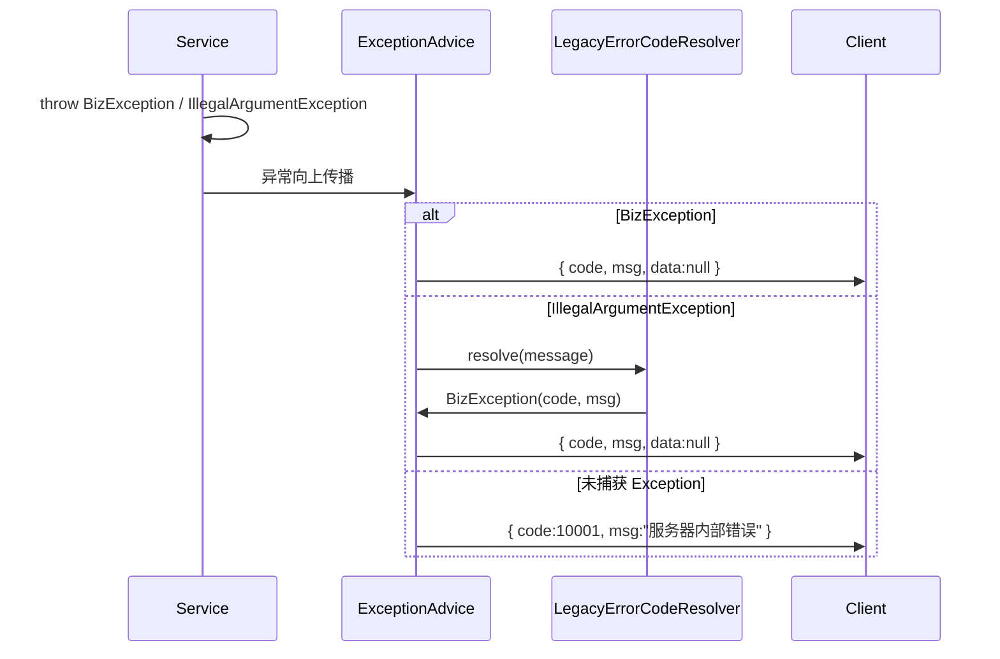
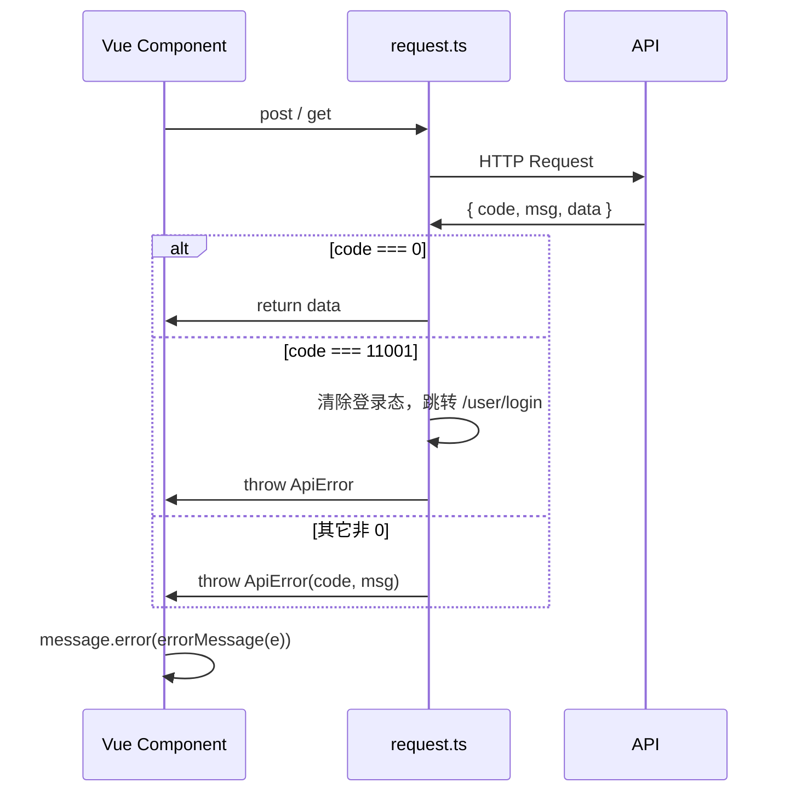

# 全局错误码管理设计文档

> 版本：1.0  
> 更新日期：2026-07-05  
> 适用范围：hfwas-devops 前后端 API 错误处理

---

## 1. 背景与目标

### 1.1 背景

改造前系统存在以下问题：

- API 失败时 `BaseResult.code` 固定为 `1`，无法区分错误类型
- 前端只能展示 `msg` 字符串，无法按错误码做分支（如自动跳转登录）
- Security Filter、业务 Service 各自返回错误，格式不统一
- 大量 `IllegalArgumentException` 散落各处，缺少结构化错误语义

### 1.2 目标

| 目标 | 说明 |
|------|------|
| 统一响应 | 所有 API 错误均返回 `{ code, msg, data }` |
| 可识别 | 每个业务错误有唯一数字 `code`，前后端一一对应 |
| 可扩展 | 按模块分段预留错误码空间，新增错误不影响已有码 |
| 平滑迁移 | 存量 `IllegalArgumentException` 无需一次性全部改写 |
| 前端友好 | 封装 `ApiError`，支持按 `code` 处理登录过期、权限不足等 |

---

## 2. 方案选型

### 2.1 业内常见做法

| 方案 | 说明 | 优点 | 缺点 |
|------|------|------|------|
| HTTP Status Only | 仅用 4xx/5xx 表达错误 | 简单 | 无法表达细粒度业务错误 |
| 字符串 Error Code | `"USER_NOT_FOUND"` | 可读性好 | 前端枚举维护成本高，不便排序/分段 |
| **分段数字 Error Code** | `12001` 表示用户不存在 | 紧凑、可分段、易监控聚合 | 需维护码表 |
| i18n Key | `error.user.not_found` | 多语言友好 | 需额外 i18n 基础设施 |

### 2.2 本项目选用方案

**分段数字错误码 + BizException + 全局异常处理 + 前端 ApiError**

参考阿里/Google API 设计思路：

1. **`code = 0`** 表示成功
2. **非 0** 为业务/系统错误，按模块划分号段
3. **HTTP Status** 表达传输层语义（401 未登录、403 无权限），**body.code** 表达业务语义
4. 业务校验失败默认 **HTTP 200 + 非 0 code**（与现有前端 `code !== 0` 判断兼容）

---

## 3. 错误码分段规则

```
 0          成功

 10000–10999  通用 / 系统
 11000–11999  认证、会话、租户上下文、权限
 12000–12999  用户
 13000–13999  租户管理
 14000–14999  会话管理（Admin）
 15000–15999  站内消息 & 通知渠道
 16000–16999  身份对接 / 集成
 20000–20999  项目
 21000–21999  事项 / 工作流 / 导入导出
 22000–22999  字段 / 配置方案
 23000–23999  功能模块

 90000–99999  预留：第三方 / 未知扩展
```

### 3.1 命名约定

- 枚举名：`UPPER_SNAKE_CASE`，如 `PROJECT_ACCESS_DENIED`
- 每个枚举项包含：**数字 code** + **默认中文 msg**
- 新增错误码须落在对应模块号段内，**禁止复用已分配 code**

### 3.2 单一数据源

| 层级 | 文件 | 职责 |
|------|------|------|
| 后端（权威） | `user-api/.../common/error/ResultCode.java` | 全量错误码定义 |
| 前端（同步） | `frontend/src/shared/errors/resultCode.ts` | 常用码 + 默认文案，其余 fallback 服务端 `msg` |

> 新增错误码时：**先改 `ResultCode.java`，再按需同步 `resultCode.ts`**。

---

## 4. API 响应规范

### 4.1 成功

```json
{
  "code": 0,
  "msg": null,
  "data": { }
}
```

### 4.2 业务失败（示例：参数错误）

```json
{
  "code": 10002,
  "msg": "项目编码和名称不能为空",
  "data": null
}
```

### 4.3 认证失败

HTTP Status：`401`

```json
{
  "code": 11001,
  "msg": "未登录或登录已过期",
  "data": null
}
```

### 4.4 权限不足

HTTP Status：`403`

```json
{
  "code": 11002,
  "msg": "无权访问",
  "data": null
}
```

### 4.5 HTTP Status 与 body.code 关系

| 场景 | HTTP Status | body.code 示例 |
|------|-------------|----------------|
| 成功 | 200 | 0 |
| 业务校验失败 | 200 | 10002、20004 … |
| 未登录 | 401 | 11001 |
| 无权限 | 403 | 11002、11005 … |
| 资源不存在 | 404（可选） | 10003、20001 … |
| 未知内部错误 | 200 | 10001 |

---

## 5. 后端架构

### 5.1 模块与类职责

```
user-api/
  com.hfwas.devops.common.error/
    ErrorCode.java          # 错误码接口
    ResultCode.java         # 错误码枚举（权威定义）
    BizException.java       # 业务异常，携带 code
    ErrorCodes.java         # 抛出辅助工具

server/
  com.hfwas.devops.common.core.base/
    BaseResult.java         # 统一响应包装
  com.hfwas.devops.common.core.exception/
    ExceptionAdvice.java           # @RestControllerAdvice 全局异常
    LegacyErrorCodeResolver.java   # 旧异常消息 → ResultCode 映射
    ApiErrorWriter.java            # Filter / Security 写 JSON 错误
  com.hfwas.devops.config/
    SecurityConfig.java            # 401/403 使用 ApiErrorWriter
    TenantContextFilter.java       # 租户校验失败写标准错误
```

### 5.2 核心类说明

#### ErrorCode / ResultCode

```java
public interface ErrorCode {
    int getCode();
    String getMessage();
}
```

`ResultCode` 枚举实现 `ErrorCode`，每个常量包含 code 与默认 msg。

#### BizException

```java
throw ErrorCodes.ex(ResultCode.PROJECT_ACCESS_DENIED);
throw ErrorCodes.ex(ResultCode.TITLE_REQUIRED, "自定义提示文案");
```

#### BaseResult

```java
BaseResult.ok(data);
BaseResult.failed(ResultCode.BAD_REQUEST);
BaseResult.failed(ResultCode.BAD_REQUEST, "具体原因");
BaseResult.failed(10002, "具体原因");
```

#### ExceptionAdvice 处理链

```
BizException              → 返回 ex.code + ex.message
IllegalArgumentException  → LegacyErrorCodeResolver 映射 → 返回对应 code
IllegalStateException     → LegacyErrorCodeResolver 映射
AuthenticationException   → 11001 UNAUTHORIZED（HTTP 401）
AccessDeniedException     → 11002 FORBIDDEN（HTTP 403）
Validation Exception      → 10002 BAD_REQUEST
Exception（其它）         → 10001 INTERNAL_ERROR
```

#### LegacyErrorCodeResolver

将存量 `throw new IllegalArgumentException("…")` **自动映射**到 `ResultCode`：

- **精确匹配**：消息字符串与枚举默认 msg 完全一致
- **前缀匹配**：如 `"状态编码重复: xxx"` → `STATUS_CODE_DUPLICATE`
- **兜底**：无法识别时 → `BAD_REQUEST(10002)`，保留原始 msg

> 新代码应直接使用 `BizException`，逐步减少 Legacy 映射依赖。

### 5.3 推荐写法（新代码）

```java
import com.hfwas.devops.common.error.ErrorCodes;
import com.hfwas.devops.common.error.ResultCode;

// 使用默认文案
ErrorCodes.check(project != null, ResultCode.PROJECT_NOT_FOUND);

// 自定义文案
if (!tenantMemberService.isActiveMember(tenantId, userId)) {
    throw ErrorCodes.ex(ResultCode.NOT_TENANT_MEMBER);
}
```

### 5.4 禁止写法

```java
// 不推荐：新代码继续抛裸 IllegalArgumentException（虽能映射，但不直观）
throw new IllegalArgumentException("项目不存在");

// 不推荐：硬编码 magic number
return BaseResult.failed(20002, "...");
// 推荐：
return BaseResult.failed(ResultCode.PROJECT_ACCESS_DENIED);
```

---

## 6. 前端架构

### 6.1 文件结构

```
frontend/src/shared/errors/
  resultCode.ts    # 错误码常量 + ERROR_MESSAGES 默认文案
  apiError.ts      # ApiError 类、errorMessage() 工具

frontend/src/shared/api/
  request.ts       # Axios 拦截器，统一解析 code 并抛出 ApiError
```

### 6.2 ApiError

```typescript
import { ApiError, errorMessage, isApiError } from '@/shared/errors/apiError'
import { ResultCode } from '@/shared/errors/resultCode'

try {
  await pmProjectApi.save(form)
} catch (e) {
  message.error(errorMessage(e))

  if (isApiError(e) && e.code === ResultCode.PROJECT_CODE_DUPLICATE) {
    // 针对性 UI 处理
  }
}
```

### 6.3 请求拦截器行为

| 条件 | 行为 |
|------|------|
| `response.data.code === 0` | 正常返回 |
| `response.data.code !== 0` | 抛出 `ApiError(code, msg)` |
| HTTP 401 或 `code === 11001` | 清除 Token / 租户缓存，跳转登录页 |
| 无 code 的网络错误 | 抛出 `ApiError(10001, …)` |

### 6.4 文案优先级

```
resolveErrorMessage(code, serverMsg):
  1. 优先使用服务端返回的 msg（支持动态细节，如 "状态编码重复: done"）
  2. 其次使用前端 ERROR_MESSAGES[code]
  3. 兜底 "请求失败"
```

---

## 7. 迁移策略

### 7.1 三阶段

| 阶段 | 动作 | 状态 |
|------|------|------|
| Phase 1 | 引入 ResultCode / BizException / ExceptionAdvice / 前端 ApiError | ✅ 已完成 |
| Phase 2 | LegacyErrorCodeResolver 覆盖现有 IllegalArgumentException 消息 | ✅ 已完成 |
| Phase 3 | 各 Service 逐步改为 `throw ErrorCodes.ex(ResultCode.XXX)` | 进行中（按需） |

### 7.2 新增错误码 Checklist

1. 在 `ResultCode.java` 对应号段添加枚举项
2. 若前端需分支判断，同步 `resultCode.ts`
3. 若存在 Legacy 字符串抛出，在 `LegacyErrorCodeResolver` 增加映射（临时）
4. Service 中改为 `BizException`（最终态）
5. 自测 API 响应 `code` 与预期一致

---

## 8. 错误码清单

### 8.1 通用（10000–10999）

| Code | 枚举 | 默认消息 |
|------|------|----------|
| 0 | SUCCESS | 成功 |
| 10001 | INTERNAL_ERROR | 服务器内部错误 |
| 10002 | BAD_REQUEST | 请求参数错误 |
| 10003 | NOT_FOUND | 资源不存在 |
| 10004 | DUPLICATE | 数据已存在 |
| 10005 | OPERATION_FAILED | 操作失败 |
| 10006 | IMPORT_EMPTY | 导入内容不能为空 |
| 10007 | SCHEMA_UNSUPPORTED | 不支持的 schema 版本 |
| 10008 | FILE_INVALID | 文件无效 |
| 10009 | FILE_READ_FAILED | 读取文件失败 |
| 10010 | FIELD_KEYS_INVALID | fieldKeys 格式错误 |

### 8.2 认证与权限（11000–11999）

| Code | 枚举 | 默认消息 |
|------|------|----------|
| 11001 | UNAUTHORIZED | 未登录或登录已过期 |
| 11002 | FORBIDDEN | 无权访问 |
| 11003 | ADMIN_REQUIRED | 需要管理员权限 |
| 11004 | PLATFORM_ADMIN_REQUIRED | 需要平台管理员权限 |
| 11005 | TENANT_FORBIDDEN | 无权访问该租户 |
| 11006 | TENANT_ID_INVALID | 无效的租户 ID |
| 11007 | TENANT_ID_REQUIRED | 租户 ID 不能为空 |
| 11008 | NOT_TENANT_MEMBER | 您尚未加入该租户 |
| 11009 | NOT_TENANT_MEMBER_CONTACT | 您尚未加入该租户，请联系管理员 |
| 11010 | TENANT_CONTEXT_MISSING | 未登录或租户上下文缺失 |

### 8.3 用户（12000–12999）

| Code | 枚举 | 默认消息 |
|------|------|----------|
| 12001 | USER_NOT_FOUND | 用户不存在 |
| 12002 | USER_PASSWORD_WRONG | 用户名或密码错误 |
| 12003 | USERNAME_PASSWORD_REQUIRED | 用户名和密码不能为空 |
| 12004 | USERNAME_DISPLAY_NAME_REQUIRED | 用户名和显示名称不能为空 |
| 12005 | USERNAME_EXISTS | 用户名已存在 |
| 12006 | INVALID_ROLE | 无效的角色 |
| 12007 | PASSWORD_REQUIRED | 新建用户必须设置密码 |
| 12008 | CANNOT_DELETE_SELF | 不能删除当前登录用户 |
| 12009 | USER_ID_REQUIRED | 用户 ID 不能为空 |
| 12010 | USER_SELECT_REQUIRED | 请选择要加入的用户 |
| 12011 | USER_NOT_MEMBER | 该用户不是租户成员 |
| 12012 | INVALID_TENANT_ROLE | 无效的租户角色 |

### 8.4 租户（13000–13999）

| Code | 枚举 | 默认消息 |
|------|------|----------|
| 13001 | TENANT_NOT_FOUND | 租户不存在 |
| 13002 | TENANT_DISABLED | 租户已停用 |
| 13003 | TENANT_CODE_EXISTS | 租户编码已存在 |
| 13004 | DEFAULT_TENANT_PROTECTED | 默认租户不可停用 |
| 13005 | DEFAULT_TENANT_DELETE_FORBIDDEN | 默认租户不可删除 |
| 13006 | TENANT_HAS_MEMBERS | 租户下仍有成员，无法删除 |
| 13007 | TENANT_HAS_PROJECTS | 租户下仍有项目，无法删除 |
| 13008 | TENANT_CODE_NAME_REQUIRED | 租户编码和名称不能为空 |
| 13009 | TENANT_CODE_FORMAT_INVALID | 租户编码格式无效 |

### 8.5 会话 / 消息 / 集成（14000–16999）

| Code | 枚举 | 默认消息 |
|------|------|----------|
| 14001 | SESSION_NOT_FOUND | 会话不存在或已下线 |
| 15001 | MESSAGE_NOT_FOUND | 消息不存在 |
| 15002 | MESSAGE_FORBIDDEN | 无权查看该消息 |
| 15003 | MESSAGE_OPERATE_FORBIDDEN | 无权操作该消息 |
| 15004–15008 | MESSAGE_* | 消息发送相关校验 |
| 15009–15013 | NOTIFY_* | 通知渠道相关 |
| 16001–16005 | CONNECTOR_* | 身份对接相关 |

### 8.6 项目（20000–20999）

| Code | 枚举 | 默认消息 |
|------|------|----------|
| 20001 | PROJECT_NOT_FOUND | 项目不存在 |
| 20002 | PROJECT_ACCESS_DENIED | 项目不存在或无权访问 |
| 20003 | PROJECT_CODE_NAME_REQUIRED | 项目编码和名称不能为空 |
| 20004 | PROJECT_CODE_DUPLICATE | 当前租户下项目编码已存在 |
| 20005 | PROJECT_ID_REQUIRED | projectId 不能为空 |
| 20006 | PROJECT_TYPE_CODE_REQUIRED | projectId 与 typeCode 不能为空 |

### 8.7 事项 / 工作流（21000–21999）

| Code | 枚举 | 默认消息 |
|------|------|----------|
| 21001 | WORK_ITEM_NOT_FOUND | 事项不存在 |
| 21002 | TITLE_REQUIRED | 标题不能为空 |
| 21003 | EXCEL_NO_DATA | Excel 中没有数据行 |
| 21004 | EXPORT_ROWS_EXCEEDED | 导出数据超过限制 |
| 21005 | EXPORT_FIELDS_REQUIRED | 请至少选择一个导出字段 |
| 21006 | IMPORT_FIELDS_REQUIRED | 请至少选择一个导入字段 |
| 21007 | EXCEL_FILE_REQUIRED | 请上传 Excel 文件 |
| 21008–21011 | COMMENT_* | 评论相关 |
| 21012–21021 | STATUS_* | 状态 / 流转相关 |
| 21022–21032 | TYPE_* / IMPORT_* / 格式错误 | 类型、导入、编码相关 |

### 8.8 字段 / 方案（22000–22999）

| Code | 枚举 | 默认消息 |
|------|------|----------|
| 22001–22007 | FIELD_* | 字段 CRUD / 绑定 |
| 22008–22017 | REMOTE_* | 远程选项加载 |
| 22018–22020 | FIELD_UNKNOWN / OPERATOR_* / SCHEME_* | 查询 & 方案 |

### 8.9 模块（23000–23999）

| Code | 枚举 | 默认消息 |
|------|------|----------|
| 23001–23009 | MODULE_* | 功能模块树相关 |

> 完整定义见：`backend/user-api/src/main/java/com/hfwas/devops/common/error/ResultCode.java`

---

## 9. 处理流程

### 9.1 后端异常流转



### 9.2 前端错误流转



---

## 10. 后续扩展建议

| 方向 | 说明 |
|------|------|
| i18n | `ResultCode` 增加 `i18nKey`，前端按 locale 加载文案 |
| 监控告警 | 按 code 聚合 Prometheus / 日志指标 |
| OpenAPI | 在 API 文档标注各接口可能返回的错误码 |
| 代码生成 | 从 `ResultCode.java` 自动生成 `resultCode.ts` |
| 移除 Legacy | 全部 Service 迁移至 `BizException` 后删除 `LegacyErrorCodeResolver` |

---

## 11. 相关文件索引

| 文件 | 路径 |
|------|------|
| 错误码枚举（权威） | `backend/user-api/src/main/java/com/hfwas/devops/common/error/ResultCode.java` |
| 业务异常 | `backend/user-api/src/main/java/com/hfwas/devops/common/error/BizException.java` |
| 抛出工具 | `backend/user-api/src/main/java/com/hfwas/devops/common/error/ErrorCodes.java` |
| 统一响应 | `backend/server/src/main/java/com/hfwas/devops/common/core/base/BaseResult.java` |
| 全局异常处理 | `backend/server/src/main/java/com/hfwas/devops/common/core/exception/ExceptionAdvice.java` |
| Legacy 映射 | `backend/server/src/main/java/com/hfwas/devops/common/core/exception/LegacyErrorCodeResolver.java` |
| Filter 错误输出 | `backend/server/src/main/java/com/hfwas/devops/common/core/exception/ApiErrorWriter.java` |
| 前端错误码 | `frontend/src/shared/errors/resultCode.ts` |
| 前端 ApiError | `frontend/src/shared/errors/apiError.ts` |
| 请求拦截器 | `frontend/src/shared/api/request.ts` |
