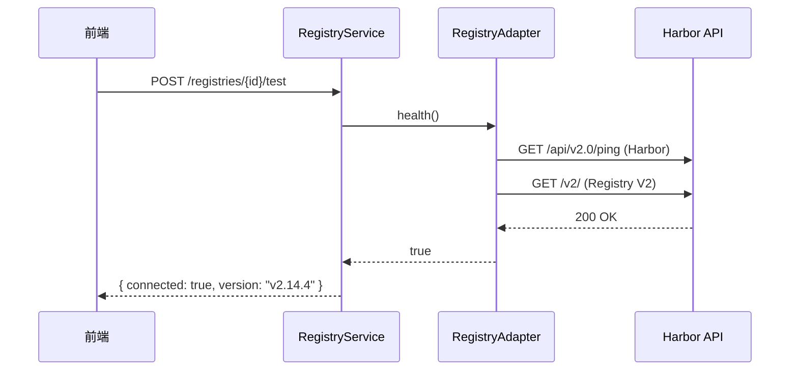
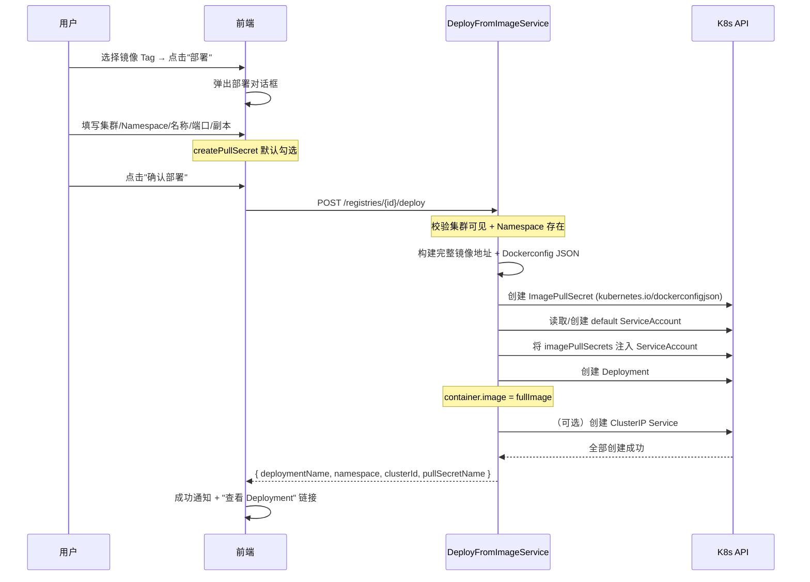

# 镜像仓库功能 — 设计文档

> 日期：2026-09-10  
> 状态：草案  
> 版本：v0.1  
> 关联：[容器管理平台总体设计方案](./container-platform-design.md) §10、[Harbor 部署文档](./harbor-deployment.md)

---

## 目录

1. [背景与目标](#1-背景与目标)
2. [现状分析](#2-现状分析)
3. [架构设计](#3-架构设计)
4. [多仓库管理与 Harbor 对接](#4-多仓库管理与-harbor-对接)
5. [API 设计](#5-api-设计)
6. [数据模型](#6-数据模型)
7. [前端设计](#7-前端设计)
8. [部署联动 — 从镜像到运行](#8-部署联动--从镜像到运行)
9. [安全设计](#9-安全设计)
10. [实施阶段](#10-实施阶段)
11. [文件变更清单](#11-文件变更清单)

---

## 1. 背景与目标

### 1.1 需求概述

容器管理平台目前已实现多集群纳管与 K8s 资源可视化管理（Phase 1），但缺少**镜像仓库管理**能力。团队已经在 k3s 集群中部署了 Harbor v2.14.4（NodePort 30002），日常开发中需要：

- 在统一的平台界面浏览、搜索镜像仓库中的项目与镜像
- 管理镜像 Tag（查看、删除、不可变标记）
- 查看镜像的安全扫描结果（Trivy）
- 将镜像一键部署到已纳管的 K8s 集群
- 管理多个镜像仓库（不止内置 Harbor，可添加外部仓库）

### 1.2 设计目标

| 目标 | 说明 |
|------|------|
| **统一入口** | 在容器管理平台中管理所有镜像仓库，不跳转 Harbor UI |
| **多仓库支持** | 支持 Harbor + 标准 Docker Registry v2（OCI 兼容） |
| **安全代理** | 所有请求走服务端代理，仓库凭据不暴露到浏览器 |
| **部署联动** | 镜像 Tag → 选择集群/Namespace → 填写参数 → 快速创建 Deployment |
| **渐进实施** | 分 2 个子阶段交付，核心浏览功能先行 |

### 1.3 非目标（明确不做）

| 范围 | 说明 |
|------|------|
| 镜像推送/Pull | 不通过本平台推送/拉取镜像。推送留在 CI/CD（Tekton Pipeline） |
| 镜像构建 | 不实现 Web UI 构建。构建由 Pipeline 模块完成 |
| 仓库自部署 | 不通过平台安装/删除 Harbor/Distribution 实例。仓库是已存在的外部资源 |
| Harbor 全量管理 | 不实现用户管理、配置、Garbage Collection、Replication 等运维功能 |
| OCI Artifact 管理 | 不管理 Helm Chart、Cosign 签名等 OCI Artifact（仅关注容器镜像） |
| Webhook 管理 | 不管理 Harbor Webhook。Pipeline 需要时直接配 Harbor 侧 |

---

## 2. 现状分析

### 2.1 现有 Harbor 部署

| 项目 | 值 |
|------|-----|
| Kubernetes 集群 | k3s v1.31.4（单节点 ARM64 + Rosetta 2） |
| Harbor 版本 | v2.14.4 |
| Helm Chart | 1.18.4 |
| 暴露方式 | NodePort（HTTP: 30002, HTTPS: 30003） |
| **集群内访问** | `http://harbor.harbor.svc.cluster.local:80`（ClusterIP） |
| **外部访问** | `http://localhost:30002` |
| 组件 | core / database / jobservice / portal / nginx / registry / trivy / redis |
| 默认管理员 | admin（密码从 secret 读取） |

### 2.2 集成路径

平台后端（Spring Boot 进程）有两类场景访问 Harbor：

```
1. 平台后端 → Harbor ClusterIP (k3s 内)
   └── 推荐：进程在 k3s 外时不可达，不适合

2. 平台后端 → localhost:30002 (NodePort 从宿主机访问)
   └── 开发/测试环境可用

3. 平台后端 → Harbor ExternalURL (用户配置)
   └── 生产推荐：用户通过 UI 注册仓库时填写 URL + 凭据
```

**决策**：采用方案 3（用户配置 ExternalURL），平台不硬编码内置 Harbor 地址。内置 Harbor 作为"默认仓库"自动发现，用户也可手动添加外部仓库。

### 2.3 现有容器管理平台后端

`container-core` 模块已实现：

- 多集群纳管（Cluster 实体、fabric8 client 工厂、心跳）
- 资源查询（Pod/Deployment/Service/ConfigMap/Secret/PVC/StatefulSet/Node）
- WebSocket（资源 Watch、日志 Tail、Pod 终端）
- 租户过滤（`X-Tenant-Id`）

**本功能将扩展 `container-core`（新增一个 `registry` 包），不另建模块。**

### 2.4 现有 Harbor API 概览

Harbor v2.14.4 REST API v2.0 核心端点：

| 端点 | 说明 |
|------|------|
| `GET /api/v2.0/projects` | 项目列表 |
| `GET /api/v2.0/projects/{project}/repositories` | 仓库列表（含镜像名） |
| `GET /api/v2.0/projects/{project}/repositories/{repo}/artifacts` | 制品列表（Tag） |
| `GET .../artifacts/{reference}/tags` | Tag 详情 |
| `DELETE .../artifacts/{reference}` | 删除制品（含 Tag） |
| `PUT .../artifacts/{reference}/tags/{tag}` | 更新 Tag（不可变标记） |
| `GET .../artifacts/{reference}/scan` | 扫描结果 |
| `GET .../artifacts/{reference}/scan/{report_id}` | 扫描报告详情 |
| `GET /api/v2.0/statistics` | 统计信息 |
| `POST /api/v2.0/projects` | 创建项目 |

> 平台不需要实现完整 Harbor API，**只需要读取子集**。

---

## 3. 架构设计

### 3.1 分层架构

```
                    前端 SPA (Vue 3 + Naive UI)
    ┌─────────────────────────────────────────────────────────┐
    │ RegistryListView │ ProjectDetail │ ImageTagView │ Deploy │
    └──────────┬──────────────────────────────────────────────┘
               │ REST
    ┌──────────▼──────────────────────────────────────────────┐
    │              container-core                             │
    │  ┌────────────────────────────────────────────────────┐ │
    │  │           Registry Bridge Layer (新增)              │ │
    │  │  RegistryService │ HarborAdapter │ RegistryV2Adapter│ │
    │  │  RegistryAuthManager │ DeployFromImageService      │ │
    │  └────────────────────────────────────────────────────┘ │
    │  ┌────────────────────────────────────────────────────┐ │
    │  │         Existing: Cluster / Resource / WS Layer    │ │
    │  └────────────────────────────────────────────────────┘ │
    └──────────────────────┬──────────────────────────────────┘
                           │ fabric8 / HTTP Client
    ┌──────────────────────▼──────────────────────────────────┐
    │  K8s Cluster 1..N    │    Harbor / Docker Registry 1..N │
    │  (已纳管)             │    (已配置凭据)                   │
    └──────────────────────┴──────────────────────────────────┘
```

### 3.2 模块划分

| 类 | 职责 | 关键依赖 |
|----|------|----------|
| **RegistryEntity** | 仓库注册信息（URL、类型、凭据、所属集群/租户） | — |
| **HarborAdapter** | Harbor REST API v2.0 调用封装 | OkHttp / RestClient |
| **RegistryV2Adapter** | Docker Registry HTTP API V2 调用封装 | OkHttp / RestClient |
| **RegistryService** | 仓库 CRUD + 适配器路由 + 调用分发 | RegistryAuthManager |
| **RegistryAuthManager** | 凭据加密存储 + 请求注入（Basic / Bearer） | KubeconfigCipher 模式 |
| **ImageService** | 镜像浏览（项目/仓库/Tag/Scan）聚合逻辑 | RegistryAdapter |
| **DeployFromImageService** | 从镜像 Tag 创建 Deployment | ResourceService + fabric8 |

### 3.3 适配器模式

```
RegistryService
    │
    ├──→ HarborAdapter (when registry.type == "harbor")
    │      implements RegistryAdapter
    │      GET /api/v2.0/projects → ...
    │
    └──→ RegistryV2Adapter (when registry.type == "registry_v2")
           implements RegistryAdapter
           GET /v2/_catalog → ...
```

**`RegistryAdapter` 接口**：

```java
interface RegistryAdapter {
    // ─── 项目/命名空间级 ───
    List<RegistryProjectVO> listProjects();

    // ─── 仓库级（镜像名列表） ───
    PageResult<RegistryRepoVO> listRepositories(String project, int page, int size);
    RegistryRepoDetailVO getRepository(String project, String repo);

    // ─── 制品/Tag 级 ───
    PageResult<ArtifactVO> listArtifacts(String project, String repo, int page, int size);
    TagVO getTag(String project, String repo, String tag);

    // ─── 删除 ───
    void deleteArtifact(String project, String repo, String reference);

    // ─── 扫描（仅 Harbor） ───
    ScanOverviewVO getScanOverview(String project, String repo, String reference);
    List<VulnerabilityVO> getVulnerabilities(String project, String repo, String reference, String reportId);

    // ─── 健康检测 ───
    boolean health();
}
```

### 3.4 内置 Harbor 自动发现

对于"当前集群内部署的 Harbor"，无需用户手动注册。策略：

- 集群详情页展示**已部署组件**（当前已有 `ClusterComponentVO`），包含 Harbor
- 组件列表包含 Harbor 时，自动在"镜像仓库"列表中创建一条"内置仓库"记录
- 自动发现的仓库 `source = "builtin"`，用户不可删除，可编辑别名
- 实现方式：通过 fabric8 查询 `harbor` Namespace 下的 `Service` 和 `Secret`

```yaml
# 自动发现逻辑
registry:
  builtin:
    enabled: true                    # 是否启用自动发现
    namespace: harbor                # 默认 Harbor 命名空间
    service-name: harbor            # Harbor service 名称
    admin-secret: harbor-core       # 从 Secret 读取管理员密码
    cluster-id: auto                 # 自动设为当前集群 ID
```

---

## 4. 多仓库管理与 Harbor 对接

### 4.1 仓库注册模型

用户可注册多个镜像仓库，模型参照集群管理：

```yaml
registry:
  tenant_id: 1                          # 租户归属
  name: "production-harbor"            # 标识名（租户内唯一）
  alias: "生产 Harbor"                  # 显示名称
  type: "harbor" | "registry_v2"       # 仓库类型
  url: "https://harbor.example.com"    # 仓库地址（含端口）
  insecure: false                       # 是否跳过 TLS 验证
  credential:
    username: "robot$project+push"     # 用户名（支持 Robot Account）
    password: "<encrypted>"            # AES-256-GCM 加密存储
  source: "manual" | "builtin"         # 来源
  cluster_id: null                      # 关联集群（可选，内置仓库必填）
  status: "Connected" | "Error" | "Unknown"
  created_at, updated_at
```

### 4.2 Harbor 凭据推荐

| 凭据类型 | 推荐 | 说明 |
|----------|------|------|
| **Admin** | ❌ 不推荐 | 权限过大，暴露风险高 |
| **Robot Account** | ✅ 推荐 | Harbor 内置的机器人账号，可精细限制到项目+操作（push/pull/read）。**密码只出现一次** |
| **普通用户** | ⚠️ 可选 | 项目成员账号，不如 Robot Account 安全 |

平台注册仓库时，建议用户创建专用 Robot Account：

```bash
# Harbor 侧创建只读 Robot Account（示例）
# 项目 → Robot Accounts → Add → 勾选 pull + read
# 生成 token 后在平台注册时填写
```

### 4.3 连接检测



### 4.4 状态心跳

复用 `ClusterHeartbeatJob` 的调度机制：

- `RegistryHeartbeatJob`：每 5 分钟对所有激活仓库做 `health()`
- 连续 3 次失败 → 标记 `status = "Error"` 并记录 `last_error`
- 恢复后自动回到 `Connected`

---

## 5. API 设计

### 5.1 REST API

沿用容器管理前缀 `/container`，无 `/api`，`/registry` 作为子路径。

```
# ─── 仓库管理（CRUD） ───
POST   /container/registries                          # 注册仓库
GET    /container/registries/page                     # 分页（租户过滤）
GET    /container/registries/{id}                     # 详情
PUT    /container/registries/{id}                     # 更新
DELETE /container/registries/{id}                     # 删除
POST   /container/registries/{id}/test                # 连接测试

# ─── 镜像浏览（代理到仓库） ───
GET    /container/registries/{id}/projects            # 获取项目列表
GET    /container/registries/{id}/projects/{project}/repositories   # 仓库（镜像）列表
GET    /container/registries/{id}/projects/{project}/repositories/{repo}/artifacts   # 制品（Tag）列表
GET    /container/registries/{id}/projects/{project}/repositories/{repo}/artifacts/{reference}/tags   # Tag 详情
DELETE /container/registries/{id}/projects/{project}/repositories/{repo}/artifacts/{reference}  # 删除制品

# ─── 扫描（仅 Harbor） ───
GET    /container/registries/{id}/projects/{project}/repositories/{repo}/artifacts/{reference}/scan   # 扫描概览
GET    /container/registries/{id}/projects/{project}/repositories/{repo}/artifacts/{reference}/scan/{reportId}/vulnerabilities  # 漏洞列表

# ─── 部署联动 ───
POST   /container/registries/{id}/deploy              # 从镜像部署到集群
```

### 5.2 WebSocket

暂不实现镜像仓库的 WebSocket 推送。扫描进度通过轮询 `GET .../scan` 实现（Trivy 扫描本身耗时较长，轮询是合理方式）。

### 5.3 DTO 定义

#### RegistryProjectVO

```json
{
  "name": "library",
  "displayName": "公共项目",
  "repoCount": 5,
  "creationTime": "2026-01-15T08:00:00Z",
  "updateTime": "2026-09-10T10:00:00Z"
}
```

#### RegistryRepoVO

```json
{
  "id": 1,
  "projectName": "library",
  "name": "library/nginx",
  "artifactCount": 10,
  "pullCount": 1024,
  "creationTime": "2026-03-01T00:00:00Z",
  "updateTime": "2026-09-10T06:00:00Z"
}
```

#### ArtifactVO

```json
{
  "digest": "sha256:abc123...",
  "tags": [
    {
      "name": "1.25.3",
      "pushTime": "2026-09-01T00:00:00Z",
      "pullTime": "2026-09-10T08:00:00Z",
      "immutable": false
    }
  ],
  "size": 25600000,
  "scanOverview": {
    "status": "completed",
    "severity": "Critical",
    "totalVulnerabilities": 15,
    "critical": 2,
    "high": 5,
    "medium": 6,
    "low": 2
  }
}
```

#### VulnerabilityVO

```json
{
  "id": "CVE-2026-1234",
  "package": "openssl",
  "version": "1.1.1t",
  "fixedVersion": "1.1.1u",
  "severity": "Critical",
  "description": "Buffer overflow in ...",
  "links": ["https://nvd.nist.gov/vuln/detail/CVE-2026-1234"]
}
```

#### DeployFromImageRequest

```json
{
  "clusterId": 1,
  "namespace": "default",
  "name": "my-app",
  "image": "library/nginx:1.25.3",
  "replicas": 2,
  "containerPort": 80,
  "createPullSecret": true,
  "pullSecretName": "harbor-pull-secret",
  "env": [
    { "name": "ENV_KEY", "value": "value" }
  ],
  "resources": {
    "cpu": "500m",
    "memory": "512Mi"
  }
}
```

| 字段 | 类型 | 必填 | 说明 |
|------|------|------|------|
| `clusterId` | Long | ✅ | 目标集群 ID（当前租户可见） |
| `namespace` | String | ✅ | 目标 Namespace |
| `name` | String | ✅ | Deployment 名称 |
| `image` | String | ✅ | 镜像地址（不含 registry 前缀） |
| `replicas` | Integer | ✅ | 副本数 |
| `containerPort` | Integer | ❌ | 容器监听端口，> 0 时自动创建 Service |
| `createPullSecret` | Boolean | ❌ | 是否自动创建拉取凭据；默认 true |
| `pullSecretName` | String | ❌ | 自定义 Secret 名称；默认 `{registry-name}-pull-secret` |
| `env` | Array | ❌ | 环境变量 |
| `resources` | Object | ❌ | CPU/Memory 资源限制 |

#### DeployResultVO

```json
{
  "clusterId": 1,
  "namespace": "default",
  "deploymentName": "my-nginx",
  "pullSecretName": "production-harbor-pull-secret",
  "serviceName": "my-nginx"
}
```

| 字段 | 类型 | 说明 |
|------|------|------|
| `clusterId` | Long | 目标集群 ID |
| `namespace` | String | 目标 Namespace |
| `deploymentName` | String | 创建的 Deployment 名称 |
| `pullSecretName` | String | 创建的 ImagePullSecret 名称（`createPullSecret=false` 时为 null） |
| `serviceName` | String | 创建的 Service 名称（未创建时为 null） |

### 5.4 VO 规范

| 规则 | 说明 |
|------|------|
| 只出 VO | 不返回 Harbor SDK 模型或 fabric8 模型 |
| 凭据不出站 | RegistryVO 中无 `credentialPassword` 字段 |
| 分页统一 | 后端 `IPage<T>`，前端 `PageResult<T>` |

---

## 6. 数据模型

### 6.1 表结构

扩展 `container-schema.sql`，新增 `registry_info` 表：

```sql
CREATE TABLE IF NOT EXISTS registry_info (
    id              INTEGER PRIMARY KEY AUTOINCREMENT,
    tenant_id       INTEGER NOT NULL,                    -- 租户 ID（必填）
    name            VARCHAR(128) NOT NULL,                -- 标识名（租户内唯一）
    alias           VARCHAR(256),                         -- 显示别名
    type            VARCHAR(32) NOT NULL DEFAULT 'harbor', -- harbor / registry_v2
    url             VARCHAR(512) NOT NULL,                -- 仓库地址
    insecure        INTEGER NOT NULL DEFAULT 0,           -- 跳过 TLS 验证
    credential_username VARCHAR(256),                     -- 用户名
    credential_password TEXT,                             -- AES-256-GCM 密文
    source          VARCHAR(32) NOT NULL DEFAULT 'manual', -- manual / builtin
    cluster_id      INTEGER,                              -- 关联集群（内置仓库必填）
    status          VARCHAR(32) NOT NULL DEFAULT 'Unknown',-- Connected / Error / Unknown
    last_error      TEXT,                                 -- 最近错误信息
    labels          TEXT DEFAULT '{}',                    -- JSON 标签
    created_at      DATETIME NOT NULL DEFAULT CURRENT_TIMESTAMP,
    updated_at      DATETIME NOT NULL DEFAULT CURRENT_TIMESTAMP,

    FOREIGN KEY (cluster_id) REFERENCES cluster_info(id) ON DELETE SET NULL
);

CREATE UNIQUE INDEX IF NOT EXISTS idx_registry_name_tenant ON registry_info(tenant_id, name);
CREATE INDEX IF NOT EXISTS idx_registry_tenant ON registry_info(tenant_id);
CREATE INDEX IF NOT EXISTS idx_registry_cluster ON registry_info(cluster_id);
```

### 6.2 实体类

```java
@Data
@TableName("registry_info")
public class RegistryEntity {
    private Long id;
    private Long tenantId;
    private String name;
    private String alias;
    private String type;        // "harbor" | "registry_v2"
    private String url;
    private Boolean insecure;
    private String credentialUsername;
    private String credentialPassword;  // AES-256-GCM ciphertext
    private String source;      // "manual" | "builtin"
    private Long clusterId;
    private String status;      // "Connected" | "Error" | "Unknown"
    private String lastError;
    private String labels;      // JSON string
    private LocalDateTime createdAt;
    private LocalDateTime updatedAt;
}
```

### 6.3 加密

复用 `KubeconfigCipher` 的模式，新增 `RegistryCredentialCipher`：

| 配置 | 说明 |
|------|------|
| `container.credential-key` | 复用现有的集群 kubeconfig 加密 key（同一安全边界） |
| 加密算法 | AES-256-GCM（与集群 kubeconfig 一致） |
| 出站禁止 | `RegistryVO` 不包含 `credentialPassword` |

---

## 7. 前端设计

### 7.1 路由

```typescript
// 在 containerRoutes 中新增：
{
  path: 'registries',
  name: 'container-registries',
  component: () => import('@/modules/container/views/Registry/RegistryListView.vue'),
},
{
  path: 'registries/:id',
  name: 'container-registry-detail',
  component: () => import('@/modules/container/views/Registry/RegistryDetailView.vue'),
  children: [
    { path: '', redirect: 'projects' },
    { path: 'projects', component: () => import('@/modules/container/views/Registry/RegistryProjectsTab.vue') },
    { path: 'scans', component: () => import('@/modules/container/views/Registry/RegistryScansTab.vue') },
  ],
},
{
  path: 'registries/:registryId/projects/:project/repos/:repo',
  name: 'container-registry-repo-detail',
  component: () => import('@/modules/container/views/Registry/RepoDetailView.vue'),
},
```

### 7.2 页面结构

```
容器管理
├── 集群管理 (已有)
├── 资源管理 (已有)
└── 镜像仓库 ← 新增
    ├── 仓库列表
    │   ├── 内置仓库（自动发现，Harbor 图标标记）
    │   ├── 手动注册仓库
    │   ├── 注册新仓库对话框
    │   └── 连接测试操作
    │
    ├── 仓库详情
    │   ├── 项目列表 Tab
    │   │   └── 每个项目 → 镜像仓库列表
    │   │       └── 每个仓库 → 制品(Tag)列表
    │   │           ├── Tag 信息（Digest/Size/PushTime）
    │   │           ├── 扫描状态徽标
    │   │           ├── 删除操作
    │   │           └── "部署"按钮 → 部署对话框
    │   │
    │   ├── 扫描结果 Tab（仅 Harbor）
    │   │   └── 漏洞列表（CVE / 严重级别 / 修复版本）
    │   │
    │   └── 基本信息（连接状态 / 类型 / URL）
    │
    ├── 部署对话框（从 Tag 部署到集群）
    │   ├── 集群选择器（已纳管集群）
    │   ├── Namespace 选择器
    │   ├── 服务名称
    │   ├── 副本数
    │   ├── 容器端口
    │   ├── 环境变量（可折叠，可选填）
    │   └── 资源限制（可选填）
    │
    └── 全局搜索（跨仓库搜索镜像名）
```

### 7.3 组件树

```
frontend/src/modules/container/
  api/
    registry.ts           ← 新增
    deploy.ts             ← 新增
  types/
    registry.ts           ← 新增
  views/
    Registry/
      RegistryListView.vue        ← 仓库列表
      RegistryDetailView.vue      ← 仓库详情（Tab 容器）
      RegistryProjectsTab.vue     ← 项目列表/镜像浏览
      RegistryScansTab.vue        ← 扫描结果
      RepoDetailView.vue          ← 制品(Tag)详情
  components/
    Registry/
      RegistryFormDialog.vue      ← 注册/编辑仓库对话框
      RegistryStatusBadge.vue     ← 连接状态徽标
      ArtifactTagList.vue         ← Tag 列表组件
      ScanSeverityBadge.vue       ← 扫描严重级别徽标
      VulnerabilityTable.vue      ← CVE 漏洞表格
      DeployFromImageDialog.vue   ← 部署对话框
```

### 7.4 关键交互

#### 仓库列表页

```
┌─────────────────────────────────────────────────────────────────┐
│ < 容器管理 / 镜像仓库                                             │
│                                                                  │
│  [+ 注册仓库]  [搜索仓库...]                                     │
│                                                                  │
│ ┌────────┬──────────┬──────────┬────────┬───────────┬──────────┐│
│ │ 名称   │ 地址       │ 类型   │ 状态   │ 项目数    │ 操作     ││
│ ├────────┼──────────┼──────────┼────────┼───────────┼──────────┤│
│ │ 🔵 内置 │ harbor:80│ Harbor  │ ● 在线  │ 3         │ 进入     ││
│ │ 仓库    │          │          │        │           │          ││
│ │ 🔵 生产 │ harbor-  │ Harbor  │ ● 在线  │ 8         │ 进入│编辑 │
│ │ Harbor  │ prod:443 │          │        │           │ │删除    ││
│ └────────┴──────────┴──────────┴────────┴───────────┴──────────┘│
└─────────────────────────────────────────────────────────────────┘
```

#### 镜像浏览流程

```
仓库详情
  └── 项目列表: [library] [team-a] [team-b]
        └── 点击 library
              └── 镜像列表: [library/nginx] [library/redis] ...
                    └── 点击 library/nginx
                          └── Tag 列表:
                              ┌────────┬──────────┬────────┬───────┐
                              │ Tag    │ 大小     │ 扫描   │ 操作  │
                              ├────────┼──────────┼────────┼───────┤
                              │ 1.25.3 │ 25.6 MB  │ 🟢 安全 │ 部署│✕│
                              │ 1.25.2 │ 25.5 MB  │ 🟡 中   │ 部署│✕│
                              │ 1.24.0 │ 24.8 MB  │ 🔴 高危 │ 部署│✕│
                              └────────┴──────────┴────────┴───────┘
```

#### 部署对话框

```
┌─────────────────────────────────────────────┐
│ 从镜像部署                                     │
│                                              │
│ 镜像: library/nginx:1.25.3                   │
│                                              │
│ 目标集群: [production-beijing ▼]             │
│ Namespace: [default                ▼]        │
│ 服务名称: [my-nginx               ]         │
│ 副本数:   [2                     [+]]       │
│ 容器端口: [80                    ]          │
│                                              │
│ ☑ 自动创建拉取凭据 (ImagePullSecret)          │
│   Secret 名称: production-harbor-pull-secret │
│                                              │
│ ▼ 环境变量（可选）                             │
│   ┌──────────┬───────┐                       │
│   │ ENV_KEY  │ value │  ✕                   │
│   └──────────┴───────┘                       │
│   [+ 添加]                                   │
│                                              │
│ ▼ 资源限制（可选）                             │
│   CPU: [500m  ]  内存: [512Mi  ]             │
│                                              │
│      [取消]                    [确认部署]      │
└─────────────────────────────────────────────┘
```

- **自动创建拉取凭据** 默认勾选（`createPullSecret: true`）
- 取消勾选后，Secret 名称字段隐藏，适合集群已配置全局 PullSecret 的场景
- Secret 名称可编辑，默认值 `{registry-name}-pull-secret`
- 部署成功后 → 跳转 Deployment 详情页（复用现有 `DeploymentDetailView`），或弹出成功通知 + "查看"按钮

### 7.5 扫描可视化

```
┌─────────────────────────────────────────────┐
│ 漏洞扫描结果 — library/nginx:1.25.2          │
│                                              │
│ 🟡 总计: 6 个漏洞  严重: 0  高危: 2  中: 3  低: 1 │
│                                              │
│ ┌─────────┬─────────┬──────────┬────────────┐│
│ │ CVE ID  │ 严重级别 │ 组件     │ 修复版本   ││
│ ├─────────┼─────────┼──────────┼────────────┤│
│ │ CVE-... │ 🔴 高危 │ openssl  │ 1.1.1u     ││
│ │ CVE-... │ 🟡 中   │ libcurl  │ 8.4.1      ││
│ │ ...     │ ...     │ ...      │ ...        ││
│ └─────────┴─────────┴──────────┴────────────┘│
│                                              │
│ 扫描时间: 2026-09-10 06:00:00 UTC            │
│ 扫描器: Trivy v0.56.0                        │
└─────────────────────────────────────────────┘
```

扫描结果缓存策略：

- FE 本地缓存当前结果（5 分钟内不重复请求）
- 用户可手动点击"重新扫描"触发 Harbor 重新扫描
- 扫描状态为 `pending` / `running` 时，前端轮询（每 10 秒，最多 5 分钟）

---

## 8. 部署联动 — 从镜像到运行

### 8.1 流程



### 8.2 后端 DeployFromImageService

```java
@Service
public class DeployFromImageService {

    public DeployResultVO deploy(Long registryId, DeployFromImageRequest request) {
        // 1. 校验集群可见（当前租户）
        ClusterEntity cluster = clusterService.getById(request.getClusterId(), tenantId);
        RegistryEntity registry = registryService.getById(registryId, tenantId);

        // 2. 校验 Namespace 存在
        KubernetesClient client = clientFactory.getClient(cluster);
        if (client.namespaces().withName(request.getNamespace()).get() == null) {
            throw new BizException("Namespace not found");
        }

        // 3. 构建完整镜像地址
        String fullImage = buildImageUrl(registry, request.getImage());

        // 4. 自动创建 ImagePullSecret（默认开启）
        String pullSecretName = request.getPullSecretName() != null
            ? request.getPullSecretName()
            : registry.getName() + "-pull-secret";

        if (request.getCreatePullSecret() == null || request.getCreatePullSecret()) {
            createPullSecretIfNotExists(client, request.getNamespace(), pullSecretName, registry);
            ensureServiceAccountHasPullSecret(client, request.getNamespace(), pullSecretName);
        }

        // 5. 创建 Deployment
        Deployment deployment = buildDeployment(fullImage, request);
        client.apps().deployments().inNamespace(request.getNamespace()).resource(deployment).create();

        // 6. （可选）创建 Service
        if (request.getContainerPort() != null) {
            Service service = buildService(request);
            client.services().inNamespace(request.getNamespace()).resource(service).create();
        }

        return new DeployResultVO(request.getClusterId(), request.getNamespace(),
            request.getName(), pullSecretName);
    }

    /**
     * 创建或更新 ImagePullSecret。复用现有 Secret 避免覆盖用户自建的。
     */
    private void createPullSecretIfNotExists(KubernetesClient client, String namespace,
            String secretName, RegistryEntity registry) {
        Secret existing = client.secrets().inNamespace(namespace).withName(secretName).get();
        if (existing != null) {
            log.info("ImagePullSecret {} already exists in namespace {}, skipping", secretName, namespace);
            return;
        }

        // 构建 Dockerconfig JSON: {"auths":{"<url>":{"username":"...","password":"...","auth":"<base64>"}}}
        String dockerAuth = registryCredentialCipher.decrypt(registry.getCredentialPassword());
        String authHeader = Base64.getEncoder().encodeToString(
            (registry.getCredentialUsername() + ":" + dockerAuth).getBytes());

        Map<String, Object> dockerConfig = Map.of("auths", Map.of(
            registry.getUrl(), Map.of(
                "username", registry.getCredentialUsername(),
                "password", dockerAuth,
                "auth", authHeader
            )
        ));

        Secret secret = new SecretBuilder()
            .withNewMetadata().withName(secretName).endMetadata()
            .withType("kubernetes.io/dockerconfigjson")
            .withData(Map.of(".dockerconfigjson",
                Base64.getEncoder().encodeToString(new ObjectMapper().writeValueAsString(dockerConfig).getBytes())))
            .build();

        client.secrets().inNamespace(namespace).resource(secret).create();
        log.info("Created ImagePullSecret {}/{} for registry {}", namespace, secretName, registry.getName());
    }

    /**
     * 确保 default ServiceAccount 绑定了该 ImagePullSecret。如果已存在则不重复添加。
     */
    private void ensureServiceAccountHasPullSecret(KubernetesClient client, String namespace, String secretName) {
        ServiceAccount sa = client.serviceAccounts().inNamespace(namespace).withName("default").get();
        if (sa == null) return;

        boolean alreadyExists = sa.getImagePullSecrets().stream()
            .anyMatch(ips -> ips.getName().equals(secretName));
        if (alreadyExists) return;

        sa.getImagePullSecrets().add(new LocalObjectReferenceBuilder().withName(secretName).build());
        client.serviceAccounts().inNamespace(namespace).resource(sa).update();
        log.info("Added ImagePullSecret {} to default ServiceAccount in namespace {}", secretName, namespace);
    }
}
```

### 8.3 完整镜像地址拼接

| 仓库类型 | 拼接逻辑 | 示例 |
|----------|----------|------|
| Harbor | `{registry_url}/{project}/{repo}:{tag}` | `harbor.example.com/library/nginx:1.25.3` |
| Registry V2 | `{registry_url}/{repo}:{tag}` | `registry.example.com/nginx:1.25.3` |

### 8.4 ImagePullSecret 自动管理

#### 策略

部署时默认自动创建 ImagePullSecret，无需用户在集群侧做任何额外操作：

| 步骤 | 操作 |
|------|------|
| 1 | 检查目标 Namespace 是否已存在同名 Secret → 有则跳过（不覆盖用户自建的） |
| 2 | 不存在则创建 `kubernetes.io/dockerconfigjson` 类型 Secret |
| 3 | 将 Secret 注入 `default` ServiceAccount 的 `imagePullSecrets` |
| 4 | Deployment 创建时，Pod 自动继承 ServiceAccount 的拉取凭据 |

#### Secret 名称规则

```
{registry-name}-pull-secret
```

示例：注册仓库名为 `production-harbor`，则 Secret 名为 `production-harbor-pull-secret`。

也可通过 `DeployFromImageRequest.pullSecretName` 自定义。

#### 凭据生命周期

| 场景 | 处理 |
|------|------|
| **仓库密码轮换** | 平台不自动更新已创建的 Secret。用户需手动在 K8s 集群更新，或删除 Secret 后重新部署 |
| **仓库删除** | 不级联删除已下发的 Secret（避免影响已运行的 Pod） |
| **跨 Namespace 共享** | 每个 Namespace 各自创建独立的 Secret |
| **绕过开关** | `createPullSecret: false` 时跳过整步，适合集群已配置全局 PullSecret 的场景 |

#### Harbor Robot Account 特殊处理

- 如果仓库凭据使用的是 Harbor **Robot Account**（用户名以 `robot$` 开头），自动创建的 Secret 直接用 Robot Account 的 token
- Robot Account 密码**只出现一次**（创建时），平台加密存储后不再暴露
- Robot Account 的权限范围：仅限于所属项目的 `pull` 操作

#### Dockerconfig JSON 构造

```json
{
  "auths": {
    "https://harbor.example.com": {
      "username": "robot$project+token",
      "password": "<encrypted-token>",
      "auth": "<base64(username:password)>"
    }
  }
}
```

---

## 9. 安全设计

### 9.1 凭据安全

| 措施 | 说明 |
|------|------|
| AES-256-GCM 加密存储 | 复用 `KubeconfigCipher` 的模式 |
| 不出 VO | `RegistryVO` 不包含 `credentialPassword` |
| 不出日志 | 加密/解密/请求过程不打印明文密码 |
| 不送到前端 | 所有 Harbor API 调用在服务端执行，前端不直接访问 Harbor |

### 9.2 ImagePullSecret 安全

自动创建的 `kubernetes.io/dockerconfigjson` Secret 包含了仓库明文密码，需要额外安全关注：

| 风险 | 缓解措施 |
|------|----------|
| Secret 明文落盘 etcd | K8s 集群侧启用 EncryptionConfig（平台不干预，属于集群安全基线） |
| 同 Namespace 用户可读 Secret | 推荐使用 Harbor Robot Account（最小权限 `pull` only），即使泄露也只影响拉取操作 |
| 跨 Namespace 传播 | 每个 Namespace 独立创建 Secret，不共享 |
| 旧 Secret 残留 | 仓库删除/密码轮换时不自动清理旧 Secret（避免影响运行中 Pod）；提供**清理指引文档** |

### 9.2 租户隔离

| 规则 | 说明 |
|------|------|
| `registry_info.tenant_id` 必填 | 与 cluster_info 一致 |
| 列表/详情/操作按 `X-Tenant-Id` 过滤 | 复用 `TenantContextFilter` |
| 跨租户访问返回 404 | 与集群管理一致 |

### 9.3 操作审计

Phase 1 至少记录：

| 操作 | 审计字段 |
|------|----------|
| 注册/更新/删除仓库 | 操作人、租户、仓库 ID、时间 |
| 连接测试 | 操作人、仓库 ID、结果 |
| 删除镜像 Tag | 操作人、租户、仓库、项目、镜像、引用、时间 |
| 部署操作 | 操作人、租户、仓库、镜像、目标集群、Namespace、时间 |

### 9.4 删除安全

- Tag 删除前二次确认弹窗（前端）
- 后端记录 `DELETE` 审计日志
- **不实现**批量删除、正则匹配删除（防止误操作）
- 删除操作返回删除的 Digest 列表，前端确认后刷新

---

## 10. 实施阶段

### Phase 1（本阶段）：核心浏览 + 部署联动

| # | 内容 | 预估 |
|---|------|------|
| 1 | `registry_info` 表 + `RegistryEntity` + `RegistryMapper` | 0.5d |
| 2 | `RegistryCredentialCipher`（复用 KubeconfigCipher 模式） | 0.25d |
| 3 | `RegistryAdapter` 接口 + `HarborAdapter`（项目/仓库/Tag 读取） | 1.5d |
| 4 | `RegistryService` CRUD + 连接测试 | 0.5d |
| 5 | `RegistryHeartbeatJob` | 0.25d |
| 6 | 内置 Harbor 自动发现（从 `harbor` Namespace 查询） | 0.5d |
| 7 | `RegistryController` + `ImageController` | 0.5d |
| 8 | 扫描概览读取（`GET .../scan`，仅展示 Trivy 结果） | 0.5d |
| 9 | `DeployFromImageService` + DeployController | 0.5d |
| 10 | 前端：仓库列表/注册/详情/镜像浏览页面 | 2d |
| 11 | 前端：扫描可视化 + 漏洞表格 | 1d |
| 12 | 前端：部署对话框 | 1d |
| 13 | 单元测试 | 0.5d |
| 14 | 集成测试 | 0.5d |
| | **合计** | **~10d** |

### Phase 2（后续）：增强能力

| 功能 | 说明 |
|------|------|
| **Registry V2 Adapter** | 对接标准 Docker Registry HTTP API V2 |
| **跨仓库全局搜索** | 在所有已注册仓库中搜索镜像名 |
| **Tag 不可变标记** | 通过 Harbor API 设置 Tag immutable |
| **Webhook 事件** | 镜像推送后通知平台，刷新缓存 |
| **镜像代理缓存** | 显示代理缓存状态（Harbor Proxy Cache 项目） |
| **批量删除** | 选中多个 Tag 批量删除（需二次确认） |
| **CVE 忽略管理** | 在平台记录已忽略的 CVE（非 Harbor 原生功能） |

### 排除项（不做）

| 功能 | 原因 |
|------|------|
| 镜像 Push | 由 CI/CD Pipeline 完成 |
| 镜像构建（Build） | 由 Tekton/Pipeline 完成 |
| 仓库部署（安装 Harbor） | 是集群运维操作，非平台职责 |
| Harbor 用户/权限管理 | 在 Harbor UI 中完成 |
| Garbage Collection | 仓库侧维护操作 |
| Replication 规则管理 | 仓库侧维护操作 |

---

## 11. 文件变更清单

### 新增文件（后端）

```
backend/container-core/src/main/java/com/hfwas/devops/container/registry/
├── entity/RegistryEntity.java
├── mapper/RegistryMapper.java
├── service/RegistryService.java
├── service/RegistryHeartbeatJob.java
├── service/RegistryCredentialCipher.java
├── service/RegistryBuiltinDiscoverer.java          # 内置 Harbor 自动发现
├── service/DeployFromImageService.java
├── adapter/RegistryAdapter.java                    # 接口
├── adapter/HarborAdapter.java                      # Harbor v2 API 实现
├── adapter/RegistryV2Adapter.java                  # Docker Registry V2（Phase 2）
├── controller/RegistryController.java
├── controller/DeployController.java
├── dto/RegistryVO.java
├── dto/RegistrySaveDTO.java
├── dto/RegistryUpdateDTO.java
├── dto/RegistryProjectVO.java
├── dto/RegistryRepoVO.java
├── dto/ArtifactVO.java
├── dto/TagVO.java
├── dto/ScanOverviewVO.java
├── dto/VulnerabilityVO.java
├── dto/DeployFromImageRequest.java
├── dto/DeployResultVO.java
└── error/RegistryErrorCode.java
```

### 修改文件（后端）

```
backend/server/src/main/resources/db/container-schema.sql    — 新增 registry_info 表
```

### 新增文件（前端）

```
frontend/src/modules/container/
├── api/registry.ts
├── api/deploy.ts
├── types/registry.ts
├── views/Registry/
│   ├── RegistryListView.vue
│   ├── RegistryDetailView.vue
│   ├── RegistryProjectsTab.vue
│   ├── RegistryScansTab.vue
│   └── RepoDetailView.vue
└── components/Registry/
    ├── RegistryFormDialog.vue
    ├── RegistryStatusBadge.vue
    ├── ArtifactTagList.vue
    ├── ScanSeverityBadge.vue
    ├── VulnerabilityTable.vue
    └── DeployFromImageDialog.vue
```

### 修改文件（前端）

```
frontend/src/modules/container/router/containerRoutes.ts  — 注册 registry 路由
```

---

## 附录 A：Harbor API 调用示例

已部署的 Harbor v2.14.4 位于 `harbor` Namespace，ClusterIP 访问：

```bash
# 从 k3s 内测试
docker exec devops-k3s sh -c '
  PWD=$(kubectl -n harbor get secret harbor-core -o jsonpath="{.data.HARBOR_ADMIN_PASSWORD}" | base64 -d)
  curl -s -u "admin:$PWD" http://harbor.harbor.svc:80/api/v2.0/projects'
```

```bash
# 从宿主机通过 NodePort 访问
PWD=$(docker exec devops-k3s kubectl -n harbor get secret harbor-core -o jsonpath="{.data.HARBOR_ADMIN_PASSWORD}" | base64 -d)
curl -s -u "admin:$PWD" http://localhost:30002/api/v2.0/projects
```

**响应示例**：

```json
[
  {
    "project_id": 1,
    "name": "library",
    "creation_time": "2026-09-10T06:40:40.644Z",
    "update_time": "2026-09-10T06:40:40.644Z",
    "current_user_role_id": 1,
    "repo_count": 0,
    "metadata": {
      "public": "true"
    }
  }
]
```

---

## 附录 B：Registry V2 API 差异

标准 Docker Registry HTTP API V2 与 Harbor API 的差异：

| 能力 | Harbor v2 API | Registry V2 API |
|------|---------------|-----------------|
| 项目概念 | 有（Project） | 无（只有 `/_catalog`） |
| 镜像列表 | `GET /api/v2.0/projects/{p}/repositories` | `GET /v2/_catalog` |
| Tag 列表 | `GET .../artifacts/{ref}/tags` | `GET /v2/{name}/tags/list` |
| Manifest | `GET .../artifacts/{ref}` | `GET /v2/{name}/manifests/{ref}` |
| 删除 | `DELETE .../artifacts/{ref}` | `DELETE /v2/{name}/manifests/{digest}` |
| 扫描 | 内置 Trivy 支持 | 无 |

**RegistryV2Adapter（Phase 2）只用实现子集**：`/_catalog`、`/tags/list`、`DELETE manifests`。

---

## 附录 C：与 Pipeline 集成

Phase 1 不做 Pipeline 集成。后续 Pipeline 构建镜像后推送目标仓库，需满足：

1. Pipeline 输出 `imageUrl`（完整镜像地址）
2. 容器管理平台展示"最近构建的镜像"列表
3. 从构建记录直接点"部署"

此集成属于 **Pipeline 模块** 的改造，不在本设计范围内。