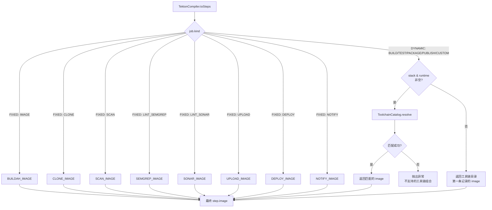

# 流水线任务镜像选择策略

> 版本：v1.0  
> 日期：2026-09-09

---

## 1. 概述

流水线中每个 Task 在执行时都需要一个容器镜像（`step.image`）。镜像的选取方式分为两类：

| 类别 | 说明 | 对应 Task |
|------|------|-----------|
| **固定镜像** | 镜像地址在代码中硬编码，可通过任务市场覆盖 | CLONE、IMAGE、SCAN、LINT_SEMGREP、LINT_SONAR、UPLOAD、DEPLOY、NOTIFY |
| **动态镜像** | 镜像地址根据用户选择的语言栈+运行时版本动态匹配 | BUILD、TEST、PACKAGE、PUBLISH、CUSTOM |

---

## 2. 固定镜像策略

### 2.1 默认值

固定镜像的 Task 在 `TektonCompiler.java` 中以常量形式定义：

| 常量 | 默认值 | 对应 Task |
|------|--------|-----------|
| `CLONE_IMAGE` | `alpine/git:2.45.2` | CLONE |
| `BUILDAH_IMAGE` | `quay.io/containers/buildah:v1.37.0` | IMAGE |
| `SCAN_IMAGE` | `aquasec/trivy:0.66.0` | SCAN |
| `SEMGREP_IMAGE` | `semgrep/semgrep:1.97.0` | LINT_SEMGREP |
| `SONAR_IMAGE` | `sonarsource/sonar-scanner-cli:11.2` | LINT_SONAR |
| `UPLOAD_IMAGE` | `rclone/rclone:1.68.2` | UPLOAD |
| `DEPLOY_IMAGE` | `bitnami/kubectl:1.31.4` | DEPLOY |
| `NOTIFY_IMAGE` | `curlimages/curl:8.11.1` | NOTIFY |
| `COSIGN_IMAGE` | `ghcr.io/sigstore/cosign:v2.4.3` | IMAGE（签名步骤） |

### 2.2 覆盖机制

上述默认值同时写入 `pipeline_task_kind` 表的 `tool_image` 字段。管理员可通过**任务市场**页面修改镜像地址，修改后后续流水线运行将使用新地址。

```
任务市场 → 编辑 IMAGE → tool_image: quay.io/containers/buildah:v1.37.0
                                      ↓
                              改为内网镜像地址
                                      ↓
                            quay.io/internal-mirror/buildah:v1.37.0
```

**注意**：目前 `TektonCompiler` 仍优先使用代码中的硬编码常量，`tool_image` 的运行时覆盖尚未接入编译器。这是下一步要做的工作。

---

## 3. 动态镜像策略（工具链系统）

### 3.1 适用场景

BUILD、TEST、PACKAGE、PUBLISH、CUSTOM 这 5 种 Task 的镜像**不能固定**，因为它们的镜像和用户选择的**语言运行时强相关**：

| 用户选择 | 期望镜像 |
|---------|---------|
| Java 21 + Maven 3.9 | `maven:3.9.9-eclipse-temurin-21` |
| Java 17 + Maven 3.9 | `maven:3.9.9-eclipse-temurin-17` |
| Node 22 + NPM | `node:22-bookworm` |
| Node 20 + PNPM | `node:20-bookworm` |
| Go 1.23 | `golang:1.23` |
| Python 3.12 | `python:3.12-bookworm` |

### 3.2 核心数据结构

**后端 — `PipelineStack.java`（支持的编程语言栈）：**

```java
public enum PipelineStack {
    JAVA_MAVEN,
    NODE,
    GO,
    PYTHON
}
```

**前端 — `pipeline.ts`：**

```typescript
export type PipelineStack = 'JAVA_MAVEN' | 'NODE' | 'GO' | 'PYTHON'
```

### 3.3 工具链目录（ToolchainCatalog）

`ToolchainCatalog.java` 维护了一个**预定义的映射表**，每条记录包含：

```java
public record ToolchainOption(
    PipelineStack stack,       // 语言栈
    String runtimeVersion,     // 运行时版本
    String toolVersion,        // 构建工具版本（可选）
    String image,              // 容器镜像
    String buildCommand,       // 默认构建命令
    String testCommand         // 默认测试命令
)
```

当前内置的映射关系（2026-09）：

| stack | runtimeVersion | toolVersion | image | buildCommand | testCommand |
|-------|---------------|-------------|-------|-------------|-------------|
| JAVA_MAVEN | 17 | 3.8 | `maven:3.8.8-eclipse-temurin-17` | `mvn -B -DskipTests package` | `mvn -B test` |
| JAVA_MAVEN | 17 | 3.9 | `maven:3.9.9-eclipse-temurin-17` | `mvn -B -DskipTests package` | `mvn -B test` |
| JAVA_MAVEN | 21 | 3.9 | `maven:3.9.9-eclipse-temurin-21` | `mvn -B -DskipTests package` | `mvn -B test` |
| NODE | 20 | NPM | `node:20-bookworm` | `npm ci` | `npm test` |
| NODE | 20 | PNPM | `node:20-bookworm` | `corepack enable && pnpm i --frozen-lockfile` | `pnpm test` |
| NODE | 20 | YARN | `node:20-bookworm` | `corepack enable && yarn install --frozen-lockfile` | `yarn test` |
| NODE | 22 | NPM | `node:22-bookworm` | `npm ci` | `npm test` |
| NODE | 22 | PNPM | `node:22-bookworm` | `corepack enable && pnpm i --frozen-lockfile` | `pnpm test` |
| NODE | 22 | YARN | `node:22-bookworm` | `corepack enable && yarn install --frozen-lockfile` | `yarn test` |
| GO | 1.22 | - | `golang:1.22` | `go build ./...` | `go test ./...` |
| GO | 1.23 | - | `golang:1.23` | `go build ./...` | `go test ./...` |
| PYTHON | 3.11 | - | `python:3.11-bookworm` | `pip install -r requirements.txt` | `pytest` |
| PYTHON | 3.12 | - | `python:3.12-bookworm` | `pip install -r requirements.txt` | `pytest` |

### 3.4 运行时匹配流程

```
用户创建流水线时：
  BUILD 任务 → 选择 stack=JAVA_MAVEN, runtime=21, tool=3.9
                  ↓
          存入 pipeline_job 表
          (stack='JAVA_MAVEN', runtime_version='21', tool_version='3.9')
                  ↓
          流水线运行 → TektonCompiler.toSteps()
                  ↓
          job.kind == BUILD
                  ↓
          TektonCompiler.toolchainImageForJob(job)
                  ↓
          ToolchainCatalog.resolve(JAVA_MAVEN, "21", "3.9")
                  ↓
          匹配到 → maven:3.9.9-eclipse-temurin-21
```

**匹配逻辑**（`ToolchainCatalog.resolve()`）：

```java
public ToolchainResolved resolve(PipelineStack stack, String runtimeVersion, String toolVersion) {
    return OPTIONS.stream()
        .filter(item -> item.stack() == stack)
        .filter(item -> Objects.equals(item.runtimeVersion(), runtimeVersion))
        .filter(item -> Objects.equals(blankToNull(item.toolVersion()), blankToNull(toolVersion)))
        .findFirst()
        .orElseThrow(() -> BizException.of(BAD_REQUEST, "不支持的工具链组合"));
}
```

匹配优先级：`stack` → `runtimeVersion` → `toolVersion`。三者全部精确匹配才命中，未命中则报错。

### 3.5 未命中时的降级

如果 `stack` 或 `runtimeVersion` 为空（旧数据或 CUSTOM 任务），回退到工具链目录的第一条记录：

```java
private static String toolchainImageForJob(PipelineJobSpec job) {
    String stack = job.stack();
    String runtime = job.runtimeVersion();
    if (stack == null || runtime == null) {
        return TOOLCHAIN.list().getFirst().image();  // → maven:3.8.8-eclipse-temurin-17
    }
    try {
        ToolchainResolved resolved = TOOLCHAIN.resolve(
                PipelineStack.valueOf(stack), runtime, job.toolVersion());
        return resolved.image();
    } catch (Exception e) {
        return TOOLCHAIN.list().getFirst().image();  // 降级到默认
    }
}
```

---

## 4. 完整镜像解析总流程图



---

## 5. 前端工具链选择

### 5.1 流水线编辑器

用户在编辑器中创建 BUILD/TEST 任务时，可以配置：

1. **构建环境（stack）**：下拉选择 `JAVA_MAVEN` / `NODE` / `GO` / `PYTHON`
2. **运行时版本（runtimeVersion）**：根据 stack 动态过滤（如 Java 可选 `17` / `21`）
3. **构建工具版本（toolVersion）**：根据 stack 过滤（如 Java 可选 `3.9`，Node 可选 `NPM` / `PNPM` / `YARN`）

### 5.2 前端数据源

前端从 `GET /pipeline/toolchains` 接口拉取可用的工具链组合：

```typescript
// api/pipeline.ts
toolchains: () => get<ToolchainOption[]>('/pipeline/toolchains')
```

返回格式：
```json
[
  {
    "stack": "JAVA_MAVEN",
    "runtimeVersion": "21",
    "toolVersion": "3.9",
    "image": "maven:3.9.9-eclipse-temurin-21",
    "buildCommand": "mvn -B -DskipTests package",
    "testCommand": "mvn -B test"
  },
  ...
]
```

### 5.3 流水线列表页的构建环境展示

`PipelineListView.vue` 从流水线各 job 的 `stack` / `runtimeVersion` 聚合出构建环境信息：

```typescript
const builds = jobs.filter(j => j.kind === 'BUILD' || j.kind === 'CUSTOM' || j.kind === 'TEST')
const envs = [...new Set(builds.map(j => j.stack).filter(Boolean))]
// 渲染为: "JAVA_MAVEN, NODE"
```

---

## 6. 扩展：客户环境覆盖工具链镜像

目前 `ToolchainCatalog` 的映射是硬编码的。如果客户环境需要替换构建镜像（如使用内网 registry），有两个方案：

### 方案 A：DB 化工具链

将 `ToolchainCatalog` 的数据源从硬编码改为 **DB 表**，新增 `pipeline_toolchain_option` 表：

```sql
CREATE TABLE pipeline_toolchain_option (
    id              INTEGER PRIMARY KEY,
    tenant_id       INTEGER NOT NULL DEFAULT 0,
    stack           TEXT    NOT NULL,          -- JAVA_MAVEN / NODE / GO / PYTHON
    runtime_version TEXT    NOT NULL,
    tool_version    TEXT,
    image           TEXT    NOT NULL,           -- 镜像地址
    build_command   TEXT,
    test_command    TEXT,
    enabled         INTEGER NOT NULL DEFAULT 1
);
```

### 方案 B：环境变量覆盖

不改动 `ToolchainCatalog`，在部署时通过环境变量注入镜像替换规则（如 `TOOLCHAIN_OVERRIDE_JAVA_MAVEN_21_3.9=custom-registry/maven:3.9.9-eclipse-temurin-21`）。

### 方案 C：任务市场扩展

在 `pipeline_task_kind` 的 `tool_image` 之外增加 `toolchain_override` 字段，允许对动态任务也配置镜像覆盖。当该字段非空时，`TektonCompiler` 优先使用它代替工具链的查询结果。

---

## 7. 相关代码文件索引

| 文件 | 说明 |
|------|------|
| `TektonCompiler.java` | 编译器，内含所有固定镜像常量 + 工具链镜像调用入口 |
| `ToolchainCatalog.java` | 工具链目录，硬编码的 stack→image 映射表 |
| `ToolchainResolved.java` | 工具链查询结果封装 |
| `PipelineStack.java` | 语言栈枚举 |
| `PipelineToolchainController.java` | 暴露 `GET /pipeline/toolchains` 接口 |
| `PipelineJobSpec.java` | 数据模型，含 stack / runtimeVersion / toolVersion 字段 |
| `PipelineJobEntity.java` | 实体类 |
| `PipelineJobDTO.java` | 数据传输对象 |
| `jobCatalog.ts` | 前端 Task 类型目录 |
| `pipeline.ts` (types) | 前端 PipelineStack 类型定义 |
| `pipeline.ts` (api) | 前端 `toolchains()` API 调用 |