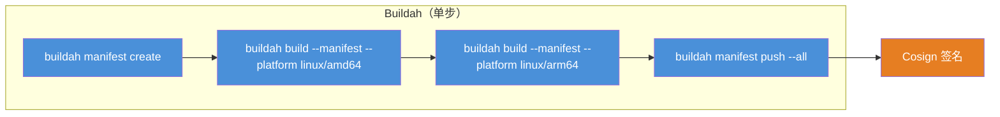

# 任务市场（Task Marketplace）设计方案

> 日期：2026-09-13
> 版本：v1.3
> 状态：定稿

### 变更记录

| 版本 | 日期 | 变更说明 |
|------|------|----------|
| v1.1 | 2026-09-09 | 定稿：任务类型元数据入库与管理页 |
| v1.2 | 2026-09-13 | 任务可配置预置环境变量（静态值 / 枚举 / 远程接口），流水线编辑时绑定写死或设为变量 |
| v1.3 | 2026-09-13 | IMAGE/LINT_SONAR 的 export 默认命令迁移到 `pipeline_task_kind_param` 预置参数；IMAGE 更新为 Buildah 描述 |

---

## 1. 背景与目标

### 1.1 现状

当前流水线系统支持 **14 种任务类型**（JobKind），其元数据分别在以下位置硬编码：

| 位置 | 文件 | 问题 |
|------|------|------|
| **后端** | `PipelineJobKind.java`（enum） | 修改描述/命令需改代码 |
| **前端** | `jobCatalog.ts`（静态数组） | 与后端枚举需手动同步 |
| **前端** | `jobIcons.ts`（图标映射） | 新增类型需同步修改 |
| **前端** | `TaskPickerDrawer.vue`（选择面板） | 直接引用静态数据 |

### 1.2 目标

- 将任务元数据**持久化到数据库**，支持运行时修改
- 提供**任务市场管理页面**，列出所有 Task 并支持编辑
- 前端数据源从硬编码迁移为 **API 驱动**
- 为未来**自定义 Task 类型**、启用/禁用、模板化**预留扩展点**

### 1.3 关键概念

- **Task Kind（任务类型）**：平台内置的基本类型枚举，如 CLONE / BUILD / IMAGE，不可新增（除非发版），可启用/禁用
- **Task Definition（任务定义）**：每个 Task Kind 的元数据实例，包含显示名称、描述、默认命令、提示信息、排序等，存储在 `pipeline_task_kind` 表中
- **Task Template（任务模板）**：扩展概念，允许用户保存自定义命令模板（未来支持）

---

## 2. 数据库设计

### 2.1 新增表

```sql
-- pipeline_task_kind：任务类型定义表
CREATE TABLE IF NOT EXISTS pipeline_task_kind (
    id               INTEGER      NOT NULL PRIMARY KEY,
    tenant_id        INTEGER      NOT NULL DEFAULT 0,      -- 0 = 全局平台定义
    kind_value       TEXT         NOT NULL UNIQUE,          -- CLONE / BUILD / IMAGE ...
    label            TEXT         NOT NULL,                 -- 显示名称（"代码克隆"）
    task_group       TEXT         NOT NULL,                 -- 分组（"代码" / "构建" / "质量控制" ...）

    description      TEXT         NOT NULL DEFAULT '',      -- 描述
    hint             TEXT         NOT NULL DEFAULT '',      -- 编辑器中的使用提示
    default_command  TEXT         NOT NULL DEFAULT '',      -- 默认命令（占位符）

    requires_command INTEGER      NOT NULL DEFAULT 1,       -- 是否需要填写命令
    enabled          INTEGER      NOT NULL DEFAULT 1,       -- 是否可用（可禁用）
    sort_order       INTEGER      NOT NULL DEFAULT 0,       -- 组内排序

    -- 高级扩展字段（自定义镜像 & 命令模板）
    tool_image       TEXT         NOT NULL DEFAULT '',      -- 自定义工具镜像
    command_template TEXT         NOT NULL DEFAULT '',      -- 命令模板（内置流水线变量）

    -- 审计字段
    deleted          INTEGER      NOT NULL DEFAULT 0,
    create_by        INTEGER,
    update_by        INTEGER,
    create_time      TEXT         NOT NULL DEFAULT (datetime('now')),
    update_time      TEXT         NOT NULL DEFAULT (datetime('now'))
);
```

### 2.2 初始化数据（14 条默认记录）

```sql
-- 代码组
INSERT INTO pipeline_task_kind (kind_value, label, task_group, description, hint, default_command, requires_command, enabled, sort_order) VALUES
('CLONE', '代码克隆', '代码', '从 Git 仓库拉取代码', 'Clone 命令由平台生成，在流水线里填写仓库与凭证即可。', '', 0, 1, 1);

-- 构建组
INSERT INTO pipeline_task_kind (kind_value, label, task_group, description, hint, default_command, requires_command, enabled, sort_order) VALUES
('BUILD', '构建', '构建', '编译与打包源码', '', '', 1, 1, 10);
INSERT INTO pipeline_task_kind (kind_value, label, task_group, description, hint, default_command, requires_command, enabled, sort_order) VALUES
('IMAGE', '镜像构建', '构建', 'Buildah 多架构构建并签名镜像', '使用任务市场预置的 DEST / IMAGE_PLATFORMS / DOCKERFILE / COSIGN_PRIVATE_KEY 参数。',
 '', 0, 1, 20);

-- 质量控制组
INSERT INTO pipeline_task_kind (kind_value, label, task_group, description, hint, default_command, requires_command, enabled, sort_order) VALUES
('LINT_SEMGREP', 'Semgrep 检查', '质量控制', 'Semgrep 静态检查', '填写 Semgrep CLI。', 'semgrep scan --error --config=auto .', 1, 1, 30);
INSERT INTO pipeline_task_kind (kind_value, label, task_group, description, hint, default_command, requires_command, enabled, sort_order) VALUES
('LINT_SONAR', 'Sonar 检查', '质量控制', 'SonarScanner 静态检查', '使用任务市场预置的 SONAR_HOST_URL / SONAR_TOKEN / SONAR_PROJECT_KEY 参数。',
 '', 0, 1, 40);
INSERT INTO pipeline_task_kind (kind_value, label, task_group, description, hint, default_command, requires_command, enabled, sort_order) VALUES
('SCAN', '安全扫描', '质量控制', '依赖与文件系统漏洞扫描', '',
 'trivy fs --exit-code 1 --scanners vuln,secret,misconfig .', 1, 1, 50);

-- 制品组
INSERT INTO pipeline_task_kind (kind_value, label, task_group, description, hint, default_command, requires_command, enabled, sort_order) VALUES
('PACKAGE', '打包', '制品', '产出可分发制品', '', '', 1, 1, 60);
INSERT INTO pipeline_task_kind (kind_value, label, task_group, description, hint, default_command, requires_command, enabled, sort_order) VALUES
('PUBLISH', '发布制品', '制品', '把制品发布到仓库', '', '', 1, 1, 70);
INSERT INTO pipeline_task_kind (kind_value, label, task_group, description, hint, default_command, requires_command, enabled, sort_order) VALUES
('UPLOAD', '上传对象存储', '制品', 'rclone 上传到对象存储', '',
 'rclone copy ./ :s3:bucket/prefix --s3-provider=Minio --s3-endpoint="${S3_ENDPOINT}" --s3-access-key-id="${S3_ACCESS_KEY}" --s3-secret-access-key="${S3_SECRET_KEY}"', 1, 1, 80);

-- 部署组
INSERT INTO pipeline_task_kind (kind_value, label, task_group, description, hint, default_command, requires_command, enabled, sort_order) VALUES
('DEPLOY', '部署', '部署', '发布到 Kubernetes 或其他环境', '', 'kubectl apply -f k8s/', 1, 1, 90);

-- 测试组
INSERT INTO pipeline_task_kind (kind_value, label, task_group, description, hint, default_command, requires_command, enabled, sort_order) VALUES
('TEST', '测试', '测试', '运行单元 / 集成测试', '', '', 1, 1, 100);

-- 命令组
INSERT INTO pipeline_task_kind (kind_value, label, task_group, description, hint, default_command, requires_command, enabled, sort_order) VALUES
('CUSTOM', '自定义命令', '命令', '在工具链镜像里执行任意命令', '', 'echo ok', 1, 1, 110);

-- 流程组
INSERT INTO pipeline_task_kind (kind_value, label, task_group, description, hint, default_command, requires_command, enabled, sort_order) VALUES
('APPROVAL', '人工卡点', '流程', '运行到此处暂停，需人工通过',
 '运行到此处会暂停，需在运行页点通过。审批节点必须单独成阶段。', '', 0, 1, 120);
INSERT INTO pipeline_task_kind (kind_value, label, task_group, description, hint, default_command, requires_command, enabled, sort_order) VALUES
('NOTIFY', '通知', '流程', 'Webhook / HTTP 通知', '',
 'curl -fsS -X POST ''https://example.com/hook'' -H ''Content-Type: application/json'' -d ''{"status":"done"}''', 1, 1, 130);
```

### 2.3 预置环境变量 `pipeline_task_kind_param`

每种 Task 可配置若干环境变量，供流水线编辑时绑定（写死 / 设为变量）。取值来源：

| param_type | 含义 | 运行时控件 |
|------------|------|-----------|
| `input` | 静态值（文本） | 输入框 |
| `select` | 枚举 | 下拉，选项来自 `options_json` |
| `api_select` | 远程接口 | 下拉，选项由后端按 `api_url` + JSONPath 拉取 |

默认种子：`CLONE.GIT_REF`（代码分支，静态值，默认 `main`）。

流水线 Job 只保存 `param_bindings`，不在流水线里新增定义。详见 `docs/pipeline/runtime-param-design.md`。

### 2.4 索引

```sql
CREATE INDEX IF NOT EXISTS idx_task_kind_tenant ON pipeline_task_kind (tenant_id, deleted);
CREATE INDEX IF NOT EXISTS idx_task_kind_group ON pipeline_task_kind (task_group, sort_order);
```

---

## 3. 后端 API 设计

### 3.1 REST 接口

| Method | Path | Description | 权限 |
|--------|------|-------------|------|
| `GET` | `/pipeline/task-kinds` | 获取所有可用 Task 类型列表 | 普通 |
| `GET` | `/pipeline/task-kinds/{kind}` | 获取单个 Task 定义详情 | 普通 |
| `PUT` | `/pipeline/task-kinds/{kind}` | 修改 Task 定义元数据 | 管理员 |
| `PATCH` | `/pipeline/task-kinds/{kind}/toggle` | 启用/禁用某个 Task | 管理员 |

### 3.2 DTO 定义

```java
// TaskKindVO.java
@Data
public class TaskKindVO {
    private String kindValue;        // CLONE
    private String label;            // 代码克隆
    private String taskGroup;        // 代码
    private String description;      // 从 Git 仓库拉取代码
    private String hint;             // Clone 命令由平台生成
    private String defaultCommand;   // 默认命令
    private Boolean requiresCommand; // 是否需要命令
    private Boolean enabled;         // 是否启用
    private Integer sortOrder;       // 排序
    private String toolImage;        // 自定义工具镜像
    private String commandTemplate;  // 命令模板
}
```

```java
// TaskKindUpdateDTO.java
@Data
public class TaskKindUpdateDTO {
    @NotBlank
    private String label;
    private String description;
    private String hint;
    private String defaultCommand;
    private String toolImage;
    private String commandTemplate;
    private Integer sortOrder;
    private java.util.List<TaskKindParamSaveDTO> params;
}
```

### 3.3 Controller

```java
@RestController
@RequestMapping("/pipeline/task-kinds")
public class PipelineTaskKindController {

    private final PipelineTaskKindService taskKindService;

    @GetMapping
    public BaseResult<List<TaskKindVO>> list() {
        return BaseResult.ok(taskKindService.listAll());
    }

    @GetMapping("/{kind}")
    public BaseResult<TaskKindVO> get(@PathVariable("kind") String kind) {
        return BaseResult.ok(taskKindService.getByKind(kind));
    }

    @PutMapping("/{kind}")
    public BaseResult<Void> update(
            @PathVariable("kind") String kind,
            @Valid @RequestBody TaskKindUpdateDTO dto) {
        taskKindService.update(kind, dto);
        return BaseResult.ok(null);
    }

    @PatchMapping("/{kind}/toggle")
    public BaseResult<Void> toggle(@PathVariable("kind") String kind) {
        taskKindService.toggle(kind);
        return BaseResult.ok(null);
    }
}
```

### 3.4 Service 核心逻辑

```java
@Service
public class PipelineTaskKindService {

    private final PipelineTaskKindMapper mapper;

    /** 返回所有记录（含禁用的），供管理页 */
    public List<TaskKindVO> listAll() {
        return mapper.selectList(...).stream()
                .map(this::toVO)
                .toList();
    }

    /** 仅返回已启用的，供编辑器/选择器使用 */
    public List<TaskKindVO> listEnabled() {
        return mapper.selectEnabled().stream()
                .map(this::toVO)
                .toList();
    }

    @Transactional
    public void update(String kind, TaskKindUpdateDTO dto) {
        PipelineTaskKindEntity entity = mapper.selectByKind(kind);
        if (entity == null) {
            throw new BizException("Task 类型不存在: " + kind);
        }
        // 只允许修改以下字段
        entity.setLabel(dto.getLabel());
        entity.setDescription(dto.getDescription());
        entity.setHint(dto.getHint());
        entity.setDefaultCommand(dto.getDefaultCommand());
        entity.setToolImage(dto.getToolImage());
        entity.setCommandTemplate(dto.getCommandTemplate());
        entity.setSortOrder(dto.getSortOrder());
        mapper.updateById(entity);
    }

    @Transactional
    public void toggle(String kind) {
        PipelineTaskKindEntity entity = mapper.selectByKind(kind);
        if (entity == null) {
            throw new BizException("Task 类型不存在: " + kind);
        }
        entity.setEnabled(entity.getEnabled() == 1 ? 0 : 1);
        mapper.updateById(entity);
    }
}
```

### 3.5 初始化保证（Flyway / DDL 脚本）

确保新表首次部署时自动创建并初始化 14 条种子数据：

```sql
-- V2__pipeline_task_kind.sql（Flyway 迁移脚本）
-- CREATE TABLE + INSERT INTO ...（同第 2 节）
```

同时保留 `PipelineJobKind.java` enum 作为**代码级常量引用**（编译期校验），但不再作为元数据来源：

```java
public enum PipelineJobKind {
    CLONE, LINT_SEMGREP, LINT_SONAR, BUILD, TEST,
    SCAN, PACKAGE, CUSTOM, IMAGE, PUBLISH,
    UPLOAD, DEPLOY, APPROVAL, NOTIFY;

    /** 校验 DB 中的 kind_value 是否合法 */
    public static boolean isValid(String kind) {
        if (kind == null) return false;
        try { valueOf(kind); return true; }
        catch (IllegalArgumentException e) { return false; }
    }
}
```

---

## 4. 前端设计

### 4.1 新增路由

**`pipelineRoutes.ts`：**

```typescript
export const pipelineRoutes: RouteRecordRaw[] = [
  {
    path: '/pipeline',
    component: () => import('@/modules/pipeline/views/PipelineShell.vue'),
    children: [
      // ... 现有路由
      {
        path: 'task-kinds',
        name: 'pipeline-task-kinds',
        component: () => import('@/modules/pipeline/views/TaskMarketView.vue'),
      },
    ],
  },
]
```

### 4.2 侧边栏菜单

**`PipelineShell.vue`：**

```vue
import { GitBranch, KeyRound, Package } from '@lucide/vue'

const menuOptions: MenuOption[] = [
  { label: '流水线', key: '/pipeline/pipelines', icon: () => h(GitBranch, { size: 16 }) },
  { label: '任务市场', key: '/pipeline/task-kinds', icon: () => h(Package, { size: 16 }) },
  { label: '凭证', key: '/pipeline/credentials', icon: () => h(KeyRound, { size: 16 }) },
]

const activeKey = computed(() => {
  if (route.path.startsWith('/pipeline/credentials')) return '/pipeline/credentials'
  if (route.path.startsWith('/pipeline/task-kinds')) return '/pipeline/task-kinds'
  return '/pipeline/pipelines'
})
```

### 4.3 API 层

**`pipeline.ts`：**

```typescript
export interface TaskKindVO {
  kindValue: string
  label: string
  taskGroup: string
  description: string
  hint: string
  defaultCommand: string
  requiresCommand: boolean
  enabled: boolean
  sortOrder: number
  toolImage: string
  commandTemplate: string
}

export const pipelineApi = {
  // ... 现有 API
  taskKinds: () => get<TaskKindVO[]>('/pipeline/task-kinds'),
  taskKind: (kind: string) => get<TaskKindVO>(`/pipeline/task-kinds/${kind}`),
  updateTaskKind: (kind: string, data: Partial<TaskKindVO>) =>
    put<void>(`/pipeline/task-kinds/${kind}`, data),
  toggleTaskKind: (kind: string) =>
    patch<void>(`/pipeline/task-kinds/${kind}/toggle`),
}
```

### 4.4 TaskMarketView.vue（主页面）

#### 页面布局

```
┌──────────────────────────────────────────────────────────────────────┐
│  任务市场                                                           │
│  管理平台支持的 14 种任务类型，支持启用/禁用和编辑元数据               │
│                                                                     │
│  ┌────── 筛选栏 ──────────────────────────────────────────────┐     │
│  │  全部  |  代码  |  构建  |  质量控制  |  制品  |  部署  ...   │     │
│  └────────────────────────────────────────────────────────────┘     │
│                                                                     │
│  ┌─ 代码 ─────────────────────────────────────────────────────┐     │
│  │ ┌────────────┐  ┌────────────┐                             │     │
│  │ │ 代码克隆     │  │  [更多]    │                             │     │
│  │ │ 从 Git 仓库  │  │            │                             │     │
│  │ │ 拉取代码     │  │            │                             │     │
│  │ │ [编辑] [禁用] │  │            │                             │     │
│  │ └────────────┘  └────────────┘                             │     │
│  └────────────────────────────────────────────────────────────┘     │
│                                                                     │
│  ┌─ 构建 ─────────────────────────────────────────────────────┐     │
│  │ ┌────────────┐  ┌────────────┐                             │     │
│  │ │ 构建        │  │ 镜像构建    │                             │     │
│  │ │ 编译与打包   │  │ Kaniko 构建 │                             │     │
│  │ │ [编辑] [禁用] │  │ [编辑] [禁用]│                             │     │
│  │ └────────────┘  └────────────┘                             │     │
│  └────────────────────────────────────────────────────────────┘     │
└──────────────────────────────────────────────────────────────────────┘
```

#### 核心逻辑

```vue
<script setup lang="ts">
import { pipelineApi } from '@/modules/pipeline/api/pipeline'
import { jobKindIcon } from '@/modules/pipeline/graph/jobIcons'
import { jobKindTone } from '@/modules/pipeline/status'
import type { TaskKindVO } from '@/modules/pipeline/types/pipeline'

const taskKinds = ref<TaskKindVO[]>([])
const activeGroup = ref<string | null>(null) // null = 全部
const editingKind = ref<TaskKindVO | null>(null)
const editDrawerShow = ref(false)

// 从数据动态提取分组
const groups = computed(() => {
  const set = new Set(taskKinds.value.map(t => t.taskGroup))
  return ['全部', ...set]
})

// 按分组过滤
const filtered = computed(() => {
  if (!activeGroup.value || activeGroup.value === '全部') return taskKinds.value
  return taskKinds.value.filter(t => t.taskGroup === activeGroup.value)
})

// 按分组 + 排序聚合
const grouped = computed(() => {
  const map = new Map<string, TaskKindVO[]>()
  for (const t of filtered.value) {
    const list = map.get(t.taskGroup) ?? []
    list.push(t)
    map.set(t.taskGroup, list)
  }
  // 每组内按 sortOrder 排序
  for (const [, list] of map) {
    list.sort((a, b) => a.sortOrder - b.sortOrder)
  }
  return map
})

async function load() {
  taskKinds.value = await pipelineApi.taskKinds()
}

function openEdit(kind: TaskKindVO) {
  editingKind.value = { ...kind } // 浅拷贝以便编辑
  editDrawerShow.value = true
}

async function saveEdit() {
  if (!editingKind.value) return
  await pipelineApi.updateTaskKind(
    editingKind.value.kindValue,
    editingKind.value,
  )
  editDrawerShow.value = false
  await load()
}

async function toggle(kind: TaskKindVO) {
  await pipelineApi.toggleTaskKind(kind.kindValue)
  await load()
}

onMounted(load)
</script>
```

#### EditDrawer（编辑面板）

```
┌─── 编辑任务 ─────────────────────────────┐
│                                          │
│  类型: CLONE                             │
│  名称: [代码克隆                    ]    │
│  分组: [代码  ▼]                         │
│  描述: [从 Git 仓库拉取代码          ]    │
│                                          │
│  使用提示:                               │
│  [Clone 命令由平台生成              ]    │
│                                          │
│  默认命令:                               │
│  [                                   ]   │
│                                          │
│  ☐ 启用                                  │
│                                          │
│  排序: [1     ]                          │
│                                          │
│  [保存]  [取消]                          │
└──────────────────────────────────────────┘
```

### 4.5 前端数据源迁移

现有的 `jobCatalog.ts` 从硬编码改为**请求后端 API**：

```typescript
// jobCatalog.ts — 重构后

import { pipelineApi } from '@/modules/pipeline/api/pipeline'
import type { TaskKindVO } from '@/modules/pipeline/types/pipeline'

// 不再硬编码，改为从 API 加载
let _cache: TaskKindVO[] | null = null
let _loadPromise: Promise<TaskKindVO[]> | null = null

export async function loadJobCatalog(): Promise<TaskKindVO[]> {
  if (_cache) return _cache
  if (!_loadPromise) {
    _loadPromise = pipelineApi.taskKinds().then(data => {
      _cache = data
      return data
    })
  }
  return _loadPromise
}

/** 设置缓存的元数据（用于 TaskPickerDrawer 等组件挂载时调用） */
export const JOB_KIND_CATALOG = reactive<TaskKindVO[]>([])

export async function ensureCatalogLoaded() {
  if (JOB_KIND_CATALOG.length === 0) {
    const data = await loadJobCatalog()
    JOB_KIND_CATALOG.splice(0, JOB_KIND_CATALOG.length, ...data)
  }
}
```

同步修改引用处：

| 文件 | 修改 |
|------|------|
| `TaskPickerDrawer.vue` | `onMounted(ensureCatalogLoaded)`，数据源改为 `JOB_KIND_CATALOG` |
| `jobIcons.ts` | 保持映射不变（`JobKind` 是编译期常量） |
| `status.ts` (`jobKindTone`) | 保持映射不变 |
| `PipelineEditorView.vue` | 通过 `ensureCatalogLoaded` 获取元数据 |

### 4.6 图标 & 色调映射（保留硬编码）

`jobIcons.ts` 和 `status.ts` 中的 `jobKindTone` 保持硬编码，因为它们是**编译期确定的 UI 样式规则**，无需运行时修改：

```typescript
// jobIcons.ts — 保持不动
export const JOB_KIND_ICONS: Record<JobKind, Component> = {
  CLONE: GitBranch,
  BUILD: Hammer,
  IMAGE: Box,
  // ...
}
```

---

## 5. 数据流

### 5.1 运行时数据流

```
前端 TaskPickerDrawer
        │
        ▼
ensureCatalogLoaded() ──────────→ GET /pipeline/task-kinds
        │                                   │
        ▼                                   ▼
  JOB_KIND_CATALOG (reactive)         PipelineTaskKindService
        │                                   │
        ▼                                   ▼
  TaskPickerDrawer.vue                 Mapper → SQLite
  按 group 分组渲染
  校验禁用状态
```

### 5.2 管理端数据流

```
TaskMarketView.vue
        │
        ├── onMounted() → GET /pipeline/task-kinds
        │                       │
        │                       ▼
        │               TaskMarketView 渲染卡片
        │
        ├── 点击编辑 → editDrawerShow = true
        │               │
        │               ▼
        │       PUT /pipeline/task-kinds/{kind} → 更新 DB
        │               │
        │               ▼
        │       reload() → 刷新列表
        │
        └── 点击禁用 → PATCH /pipeline/task-kinds/{kind}/toggle
                        │
                        ▼
                reload() → 刷新列表 + 清除前端缓存
```

---

## 6. 权限设计

| 操作 | 权限 |
|------|------|
| 查看 Task 列表 | 普通用户 |
| 编辑 Task 元数据 | 管理员（`auth.isAdmin`） |
| 启用/禁用 Task | 管理员（`auth.isAdmin`） |

前端控制：

```vue
// TaskMarketView.vue
const auth = useAuthStore()
const isAdmin = computed(() => auth.isAdmin)
// 只有管理员才显示编辑/禁用按钮
```

---

## 7. 后端枚举改动

### 7.1 `PipelineJobKind.java` 精简

移除 metadata 字段，只保留常量定义用于代码引用：

```java
public enum PipelineJobKind {
    CLONE, LINT_SEMGREP, LINT_SONAR, BUILD, TEST,
    SCAN, PACKAGE, CUSTOM, IMAGE, PUBLISH,
    UPLOAD, DEPLOY, APPROVAL, NOTIFY;

    public static boolean isValid(String kind) {
        if (kind == null) return false;
        try {
            PipelineJobKind.valueOf(kind);
            return true;
        } catch (IllegalArgumentException e) {
            return false;
        }
    }
}
```

### 7.2 后端引用修改

| 文件 | 改动 |
|------|------|
| `PipelineJobSpec.java` | `PipelineJobKind kind()` 保持 enum 引用不变 |
| `PipelineGraphValidator.java` | 校验逻辑不变，仍引用 `PipelineJobKind` enum |
| `PipelineJobEntity.java` | `kind` 字段保持 String，兼容 DB 值 |
| `PipelineJobDTO.java` | `kind` 字段保持 String |
| `TektonCompiler.java` | Kind 匹配逻辑不变 |

---

## 8. 实现步骤

| # | 步骤 | 涉及文件 | 工时 |
|---|------|----------|------|
| 1 | **后端：新建表 DDL + 初始化数据** | `pipeline-task-kind.sql` 或 Flyway 迁移 | 0.5h |
| 2 | **后端：新建 Entity + Mapper** | `PipelineTaskKindEntity.java`, `PipelineTaskKindMapper.java` | 0.5h |
| 3 | **后端：新建 Service + Controller + DTO** | `PipelineTaskKindService.java`, `PipelineTaskKindController.java`, `TaskKindVO.java`, `TaskKindUpdateDTO.java` | 1h |
| 4 | **后端：精简 PipelineJobKind enum** | `PipelineJobKind.java`（移除 label/command 元数据） | 0.2h |
| 5 | **前端：新增路由 + 侧边栏菜单** | `pipelineRoutes.ts`, `PipelineShell.vue` | 0.3h |
| 6 | **前端：新增 API 调用** | `api/pipeline.ts`（加 `TaskKindVO` 类型 + `taskKinds()` 等） | 0.3h |
| 7 | **前端：实现 TaskMarketView.vue** | `TaskMarketView.vue`（列表 + 编辑抽屉 + 启用/禁用） | 2h |
| 8 | **前端：重构 jobCatalog.ts 为 API 驱动** | `jobCatalog.ts`, `TaskPickerDrawer.vue`（`onMounted` 调用） | 1h |
| 9 | **前端：编辑页的编辑面板 EditTaskDrawer** | `EditTaskDrawer.vue` 或集成在 `TaskMarketView.vue` 内 | 1.5h |
| 10 | **测试：后端 API 单元测试** | `PipelineTaskKindControllerTest.java` | 0.5h |
| 11 | **测试：前端组件测试** | `TaskMarketView.test.ts` | 0.5h |
| 12 | **测试：regression（编辑器选 task 确认正常）** | 手动验证 | 0.5h |

**合计工时：约 8.8h（1 人天）**

---

## 9. 风险与注意事项

| 风险 | 影响 | 缓解措施 |
|------|------|----------|
| 前端 `jobCatalog.ts` 重构后，旧组件可能在 API 加载完成前渲染 | TaskPickerDrawer 空白 | 使用 `ensureCatalogLoaded()` + loading 态 |
| `kind_value` 是暴露给 API 的，如果未来 enum 改名会导致历史数据不兼容 | DB 数据异常 | `PipelineJobKind` 的 name() 一经发布不再修改；必要时保留兼容映射 |
| 管理页编辑时多用户并发覆盖 | 数据丢失 | 使用乐观锁（`update_time` 比对）或后端简单事务 |
| 禁用某个 Task Kind 后，已有 Pipeline 引用它 | 运行时报错 | **直接破坏时更新**——运行到已禁用的 Task 时直接报错并中止；新建 Pipeline 时前端过滤掉禁用的 Task |
| 后端 `PipelineJobKind` enum 与 DB 不一致（如发版新增但未跑迁移） | 编译期缺失声明 | 通过集成测试校验 `kind_value` 覆盖 enum 所有值 |

---

## 10. 扩展预留

| 扩展点 | 说明 | 影响 |
|--------|------|------|
| **自定义 Task 注册** | 未来用户可通过 API 注册新 `kind_value` | 需要修改 `PipelineJobKind` 校验逻辑，允许 whitelist 之外的 kind |
| **命令模板** | `command_template` 字段支持内置变量注入（`${workspace}`, `${image}`） | 新增 `TektonCompiler` 模板渲染逻辑 |
| **多租户隔离** | `tenant_id` 字段预留，未来支持租户级 Task 覆盖 | 查询时增加 tenant_id 过滤 |
| **按 stack 筛选** | 某些 Task 仅对特定语言栈可见（如 Maven 仅 Java） | 新增 `stack_filter` 字段（逗号分隔） |
| **Task 版本管理** | 保留修改历史，支持回滚 | 新增 `pipeline_task_kind_history` 表 + audit 触发器 |

---

---

## 12. IMAGE 任务迁移：Kaniko → Buildah（多架构支持）

### 12.1 背景

当前 IMAGE 任务基于 **Kaniko** 构建镜像，使用 **Crane** 合并多架构 manifest，再通过 **Cosign** 签名：

```
Kaniko (构建 linux/amd64) ──→ registry:tag-amd64
Kaniko (构建 linux/arm64) ──→ registry:tag-arm64
Crane (合并 manifest)    ──→ registry:tag
Cosign (签名)            ──→ 签名 attestation
```

这个流程需要 **3 个独立步骤、3 个不同镜像**，且 Crane 合并后的 manifest 不保留构建缓存。

### 12.2 Buildah 方案优势

Buildah 原生支持多架构 manifest，一步完成构建 + manifest 管理 + 推送：



| 对比项 | Kaniko + Crane + Cosign | Buildah（单步） |
|--------|------------------------|----------------|
| 镜像数量 | 3 个（executor / crane / cosign） | 2 个（buildah / cosign） |
| 步骤数 | 3 个步骤 | 2 个步骤 |
| 多架构 | `--custom-platform` + Crane 合并 | `--manifest` + `--platform` 原生支持 |
| 缓存 | `--cache-dir=/cache`（需 PVC） | 无需额外缓存卷 |
| 特权 | 不需要 | 不需要（rootless） |
| Red Hat 推荐 | ❌ | ✅ |
| OCI 标准 | ✅ | ✅ |

### 12.3 后端改动：TektonCompiler.java

#### 常量变更

```java
// 移除
public static final String KANIKO_IMAGE = "gcr.io/kaniko-project/executor:v1.23.2-debug";
public static final String CRANE_IMAGE = "gcr.io/go-containerregistry/crane:v0.20.3";

// 新增
public static final String BUILDAH_IMAGE = "quay.io/buildah/stable:v1.37.0";
// Cosign 保留
public static final String COSIGN_IMAGE = "ghcr.io/sigstore/cosign:v2.4.3";
```

#### 镜像构建脚本重写

```java
if (job.kind() == PipelineJobKind.IMAGE) {
    return List.of(
            new CompiledStep(base, BUILDAH_IMAGE, imageBuildahScript(command), env, false, false),
            new CompiledStep(base + "-cosign", COSIGN_IMAGE, imageCosignScript(command), env, false, false)
    );
}
```

#### Buildah 多架构脚本

```java
private static String imageBuildahScript(String command) {
    return evalPrefix(command) + """
            
            : "${DEST:?DEST is required}"
            : "${IMAGE_PLATFORMS:=linux/amd64,linux/arm64}"
            : "${DOCKERFILE:=Dockerfile}"
            
            # 解析 platforms 数量（逗号分隔）
            n=0
            for p in $(echo "$IMAGE_PLATFORMS" | tr ',' ' '); do
              p=$(echo "$p" | tr -d ' ')
              [ -n "$p" ] || continue
              n=$((n + 1))
            done
            
            if [ "$n" -eq 1 ]; then
              # 单架构：直接 build + push
              buildah build --file "$DOCKERFILE" --platform "$IMAGE_PLATFORMS" -t "$DEST" .
              buildah push "$DEST"
            else
              # 多架构：manifest 方式
              buildah manifest create "$DEST"
              for p in $(echo "$IMAGE_PLATFORMS" | tr ',' ' '); do
                p=$(echo "$p" | tr -d ' ')
                [ -n "$p" ] || continue
                buildah build \\
                  --manifest "$DEST" \\
                  --platform "$p" \\
                  --file "$DOCKERFILE" \\
                  .
              done
              buildah manifest push --all "$DEST" "docker://$DEST"
            fi
            """.stripIndent();
}
```

#### 移除 Crane 脚本

```java
// 删除以下方法（不再需要）
// private static String imageCraneScript(String command) { ... }
```

### 12.4 后端改动：CompiledStep.java

```java
// 重命名
public record CompiledStep(
        String name,
        String image,
        String script,
        Map<String, String> env,
        boolean usesGitSecret,
        boolean usesKanikoCache   // → 改为 needsPrivileged（兼容旧构造器）
) {
    public CompiledStep(String name, String image, String script, Map<String, String> env, boolean usesGitSecret) {
        this(name, image, script, env, usesGitSecret, false);
    }
}
```

Buildah 步骤的 `needsPrivileged` 传 `false`（rootless 模式），暂不修改字段名以保持最小改动。如果未来需要特权模式，可在此扩展。

### 12.5 后端改动：CompiledTekton.java

```java
// 移除 kaniko cache 相关方法
// public boolean anyKanikoCache() { ... }
// → 替换为 buildah 不需要缓存
// 全部返回 false

public boolean anyKanikoCache() {
    return false;  // Buildah 不需要 kaniko 缓存
}
```

### 12.6 后端改动：TektonManifests.java

```java
// 移除 Kaniko 缓存 workspace 的声明
// private static PersistentVolumeClaim kanikoCacheClaim(...) { ... }

// Task 定义中不再添加缓存 workspace
public static Task task(String namespace, CompiledTask compiled, String gitSecretName) {
    // ...
    List<io.fabric8.tekton.v1.WorkspaceDeclaration> workspaces = new ArrayList<>();
    workspaces.add(new WorkspaceDeclarationBuilder().withName(TektonCompiler.WORKSPACE).build());
    // 移除: if (compiled.steps().stream().anyMatch(CompiledStep::usesKanikoCache)) { ... }
    // ...
}

// Pipeline 定义中不再声明缓存 workspace
public static Pipeline pipeline(String namespace, CompiledTekton compiled) {
    // ...
    List<io.fabric8.tekton.v1.PipelineWorkspaceDeclaration> pws = new ArrayList<>();
    pws.add(new PipelineWorkspaceDeclarationBuilder().withName(TektonCompiler.WORKSPACE).build());
    // 移除: if (compiled.anyKanikoCache()) { ... }
    // ...
}
```

### 12.7 后端改动：TektonPipelineExecutor.java

```java
// 移除 kaniko cache PVC 的创建
// String cacheClaim = compiled.anyKanikoCache() ? DnsNames.kanikoCache(pipeline.getId()) : null;
// if (cacheClaim != null) {
//     client.persistentVolumeClaims().inNamespace(namespace)
//             .resource(TektonManifests.kanikoCacheClaim(namespace, cacheClaim))
//             .serverSideApply();
// }
// → 替换为:
String cacheClaim = null;  // Buildah 不需要缓存 PVC

// TaskRun / PipelineRun 不再传入 cacheClaim
tekton.v1().taskRuns().inNamespace(namespace)
        .resource(TektonManifests.taskRun(namespace, compiled.name(), task.name(), null))
        .serverSideApply();
```

### 12.8 后端改动：DnsNames.java

```java
// 移除 kaniko 缓存命名方法
// public static String kanikoCache(long pipelineId) { ... }
```

### 12.9 前端改动：IMAGE 任务元数据更新

**`jobCatalog.ts`** 中 IMAGE 任务的默认命令和提示改为 Buildah 模式：

```typescript
{
  value: 'IMAGE',
  label: '镜像构建',
  group: '构建',
  description: 'Buildah 多架构构建并推送镜像',
  hint: '填写 DEST / IMAGE_PLATFORMS / DOCKERFILE；可选 COSIGN_PRIVATE_KEY。支持 linux/amd64,linux/arm64 等多架构。',
  requiresCommand: true,
  defaultCommand:
    'export DEST=registry.example.com/app:tag\n'
    + 'export IMAGE_PLATFORMS=linux/amd64,linux/arm64\n'
    + 'export DOCKERFILE=Dockerfile',
},
```

**`PipelineJobKind.java`** 中 IMAGE 的默认命令同步更新。

### 12.10 多架构使用示例

用户在 IMAGE 任务中配置以下环境变量：

```bash
export DEST=registry.example.com/my-app:v1.0.0
export IMAGE_PLATFORMS=linux/amd64,linux/arm64
export DOCKERFILE=Dockerfile
# 可选签名
export COSIGN_PRIVATE_KEY=...
```

运行时 Buildah 会：
1. `buildah manifest create registry.example.com/my-app:v1.0.0`
2. `buildah build --manifest ... --platform linux/amd64 ...` → 构建 amd64 并加入 manifest
3. `buildah build --manifest ... --platform linux/arm64 ...` → 构建 arm64 并加入 manifest
4. `buildah manifest push --all ...` → 推送含两个架构的 manifest list

最终 `docker pull registry.example.com/my-app:v1.0.0` 会根据拉取节点的架构自动获取对应镜像。

### 12.11 迁移注意事项

| 注意点 | 说明 |
|--------|------|
| **特权模式** | Buildah rootless 模式不需要 `privileged: true`，但如果用户 Dockerfile 需要 `--device` 或 FUSE，可能需要调整 |
| **缓存** | Kaniko 使用 `--cache-dir=/cache` + PVC 缓存；Buildah 默认利用本地层缓存（同一 Pod 内），无需额外 PVC |
| **Cosign 签名** | Buildah 步骤完成后取镜像 digest，传给 Cosign 步骤签名。签名逻辑与之前一致 |
| **兼容性** | 存量 Pipeline 中的 IMAGE 任务在下次运行时使用新脚本，只需确保用户填写的命令（DEST/DOCKERFILE/IMAGE_PLATFORMS）兼容即可 |

### 12.12 文件改动清单

| 文件 | 改动类型 |
|------|----------|
| `TektonCompiler.java` | 常量替换、脚本重写、Crane 方法删除 |
| `CompiledStep.java` | 字段含义调整（usesKanikoCache → 可忽略） |
| `CompiledTekton.java` | anyKanikoCache() 返回 false |
| `TektonManifests.java` | 移除 kaniko cache workspace 声明 |
| `TektonPipelineExecutor.java` | 移除 cache PVC 创建逻辑 |
| `DnsNames.java` | 移除 kanikoCache() 方法 |
| `jobCatalog.ts` | IMAGE 任务描述/默认命令更新 |
| `PipelineJobKind.java` | IMAGE 默认命令更新 |

### 11.1 文件清单

```
新增：
  backend/.../graph/pipeline_task_kind.sql          — DDL + 初始化数据
  backend/.../entity/PipelineTaskKindEntity.java    — Entity
  backend/.../mapper/PipelineTaskKindMapper.java    — MyBatis Mapper
  backend/.../dto/TaskKindVO.java                   — 响应 DTO
  backend/.../dto/TaskKindUpdateDTO.java            — 更新请求 DTO
  backend/.../controller/PipelineTaskKindController.java  — Controller
  backend/.../service/PipelineTaskKindService.java  — Service
  frontend/.../views/TaskMarketView.vue             — 任务市场页面
  frontend/.../components/EditTaskDrawer.vue        — 编辑面板（可选独立组件）

修改：
  backend/.../graph/PipelineJobKind.java            — 精简为纯枚举
  frontend/.../router/pipelineRoutes.ts             — 新增路由
  frontend/.../views/PipelineShell.vue              — 新增菜单项
  frontend/.../types/pipeline.ts                    — 新增 TaskKindVO 类型
  frontend/.../api/pipeline.ts                      — 新增 API 调用
  frontend/.../graph/jobCatalog.ts                  — 重构为 API 驱动
  frontend/.../components/TaskPickerDrawer.vue      — 数据源切换
```

### 11.2 参考

- 现有 Task 类型定义：`jobCatalog.ts` | `PipelineJobKind.java`
- 现有 DB 设计：`pipeline-schema.sql`（SQLite）
- 菜单模式参考：`PipelineShell.vue`（侧边栏）
- 选择面板参考：`TaskPickerDrawer.vue`（分组渲染）