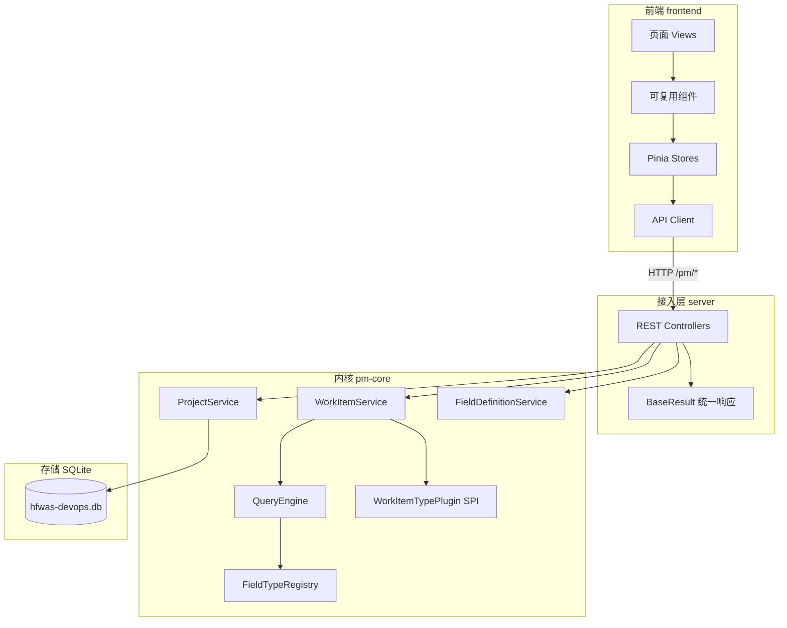
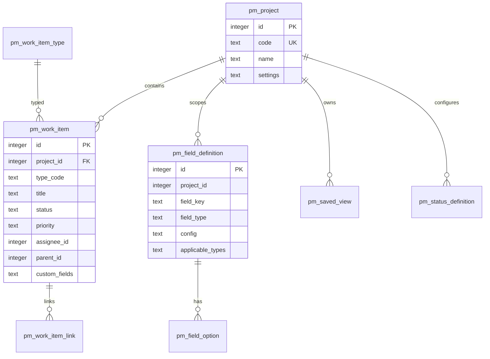
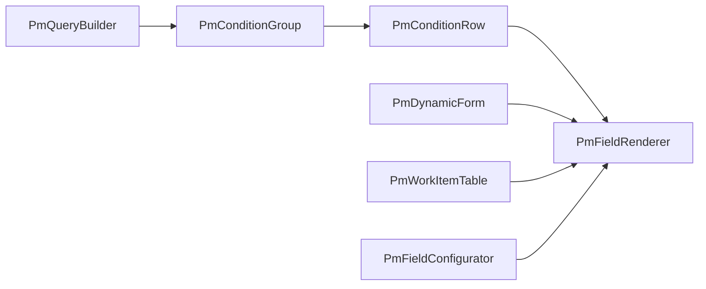

# 项目管理模块设计文档

> 版本：1.0  
> 更新日期：2026-07-03  
> 适用范围：hfwas-devops 项目管理（PM）子系统

---

## 1. 概述

### 1.1 目标

构建一套可扩展的项目管理系统，支持：

- **项目**管理
- 统一 **WorkItem（事项）** 管理：需求、任务、缺陷、测试用例等
- **动态字段**配置：按项目/类型自定义字段
- **组合查询**：可视化选择字段、运算符，多条件 AND/OR 组合
- **看板、状态流转、事项关联** 等协作能力

### 1.2 设计原则

| 原则 | 说明 |
|------|------|
| 统一事项模型 | 多种类型共用一张表 + 类型插件，避免重复 CRUD/查询逻辑 |
| 内核与接入分离 | `pm-core` 承载领域逻辑，`server` 仅做 HTTP 适配 |
| 组件可复用 | 前端字段渲染、查询构建、动态表单跨页面复用 |
| 快速落地 | SQLite 文件数据库，零外部依赖启动 |
| 可扩展 | 字段类型 SPI、事项类型 SPI、查询运算符可注册扩展 |

### 1.3 技术栈

| 层级 | 技术 |
|------|------|
| 后端 | Java 21、Spring Boot 3、MyBatis-Plus、SQLite |
| 前端 | Vue 3、TypeScript、Vite、Naive UI、Pinia、axios |
| 数据库 | SQLite（`./data/hfwas-devops.db`） |

---

## 2. 系统架构

### 2.1 总体结构

```
hfwas-devops/
├── backend/
│   ├── pm-core/                 # PM 内核（领域 + 引擎 + Mapper）
│   └── server/                  # Spring Boot 启动 + REST API
├── frontend/
│   └── src/modules/pm/          # PM 前端模块
└── docs/
    └── pm-design.md             # 本文档
```

### 2.2 分层架构



### 2.3 模块职责

| 模块 | 职责 | 依赖 |
|------|------|------|
| `pm-core` | 实体、Mapper、字段引擎、查询引擎、领域服务、SPI | Spring Context、MyBatis-Plus |
| `server` | 启动类、Controller、全局异常、Security、Schema 初始化 | `pm-core`、Spring Web |
| `frontend/modules/pm` | 页面、可复用组件、状态、API 封装 | Naive UI、Pinia |

---

## 3. 领域模型

### 3.1 统一 WorkItem 模型

需求、任务、缺陷、测试用例等 **不建独立业务表**，采用 **WorkItem + type_code** 区分类型（类似 Jira Issue Type）。

**优势：**

- 动态字段、查询构建器、列表/看板跨类型复用
- 新增类型（Epic、Release）只需注册类型插件与字段 schema
- 统一 API：`/pm/work-items/*`

### 3.2 ER 关系



### 3.3 内置事项类型

| code | 名称 | 说明 |
|------|------|------|
| `requirement` | 需求 | 产品/业务需求 |
| `task` | 任务 | 开发/执行项 |
| `bug` | 缺陷 | 问题跟踪 |
| `test_case` | 测试用例 | 测试项 |

### 3.4 系统字段 vs 自定义字段

| 类别 | 存储方式 | 示例 |
|------|----------|------|
| 系统字段 | `pm_work_item` 列 | title、status、priority、assignee_id、parent_id |
| 自定义字段 | `custom_fields` JSON 文本 | severity、story_points、module |

查询时：

- 系统字段：直接映射列名
- 自定义字段：使用 `custom.{field_key}` 前缀，通过 `json_extract()` 查询

---

## 4. 数据库设计

数据库：**SQLite**，Schema 文件：`backend/server/src/main/resources/db/pm-schema.sql`  
启动时由 `SqliteSchemaInitializer` 自动执行建表与种子数据。

### 4.1 表清单

| 表名 | 说明 |
|------|------|
| `pm_project` | 项目主表 |
| `pm_project_member` | 项目成员（预留权限） |
| `pm_work_item_type` | 事项类型注册表 |
| `pm_work_item` | 统一事项表 |
| `pm_field_definition` | 字段元数据 |
| `pm_field_option` | 下拉/多选选项 |
| `pm_work_item_link` | 事项关联（关联/阻塞/重复） |
| `pm_status_definition` | 状态及流转规则 |
| `pm_saved_view` | 用户保存的视图（QuerySpec + 列配置） |

### 4.2 核心表结构（摘要）

**pm_work_item**

```sql
CREATE TABLE pm_work_item (
    id            INTEGER PRIMARY KEY,
    project_id    INTEGER NOT NULL,
    type_code     TEXT NOT NULL,
    title         TEXT NOT NULL,
    status        TEXT DEFAULT 'open',
    priority      TEXT DEFAULT 'medium',
    assignee_id   INTEGER,
    parent_id     INTEGER,
    custom_fields TEXT,          -- JSON
    del_flag      INTEGER DEFAULT 0
);
```

**pm_field_definition**

```sql
CREATE TABLE pm_field_definition (
    id               INTEGER PRIMARY KEY,
    project_id       INTEGER,
    field_key        TEXT NOT NULL,
    field_name       TEXT NOT NULL,
    field_type       TEXT NOT NULL,   -- TEXT/SELECT/USER/...
    config           TEXT,            -- JSON：选项、校验规则等
    applicable_types TEXT,            -- JSON：适用的事项类型
    system_flag      INTEGER DEFAULT 0
);
```

### 4.3 默认状态流转

任务（task）示例：

```
open → in_progress → done → closed
  └──────────────────────→ closed
```

流转规则存储在 `pm_status_definition.transitions`（JSON 数组），由 `WorkItemService.transition()` 校验。

---

## 5. 后端设计（pm-core）

### 5.1 包结构

```
com.hfwas.devops.pm
├── config/              PmCoreAutoConfiguration
├── common/              PmPageRequest
├── project/             项目聚合
├── workitem/            事项 CRUD、关联、流转
├── field/
│   ├── model/           FieldDefinition、FieldType
│   ├── engine/          FieldTypeRegistry、FieldValidator
│   ├── service/         FieldDefinitionService
│   └── spi/handler/     各字段类型 Handler
├── query/
│   ├── model/           QuerySpec、QueryCondition
│   └── engine/          QueryEngine、FieldResolver、JsonSqlDialect
├── view/                SavedView 管理
├── meta/                事项类型元数据
└── spi/
    ├── plugin/          WorkItemTypePlugin 实现
    └── registry/        WorkItemTypeRegistry
```

### 5.2 字段引擎（Field Engine）

**职责：** 字段定义 CRUD、值校验、默认值规范化、查询 SQL 片段生成。

**SPI 接口：**

```java
public interface FieldTypeHandler {
    FieldType type();
    void validate(FieldDefinition def, Object value);
    Object normalize(FieldDefinition def, Object raw);
    String buildQuerySql(FieldDefinition def, QueryCondition cond);
}
```

**内置字段类型：**

| 类型 | 说明 |
|------|------|
| TEXT / TEXTAREA | 文本 |
| NUMBER | 数字 |
| SELECT / MULTI_SELECT | 单选/多选 |
| DATE / DATETIME | 日期 |
| USER | 用户 ID |
| BOOLEAN | 布尔 |
| PRIORITY / STATUS | 优先级/状态（内置选项） |

**扩展方式：** 实现 `FieldTypeHandler` 并注册为 Spring `@Component`，自动加入 `FieldTypeRegistry`。

### 5.3 查询引擎（Query Engine）

**职责：** 将前端 `QuerySpec` 转为 MyBatis-Plus 动态条件，支持嵌套 AND/OR。

**QuerySpec 协议：**

```json
{
  "projectId": 1,
  "typeCode": "task",
  "logic": "AND",
  "conditions": [
    { "field": "status", "operator": "IN", "value": ["open", "in_progress"] },
    { "field": "custom.severity", "operator": "EQ", "value": "critical" }
  ],
  "groups": [
    {
      "logic": "OR",
      "conditions": [
        { "field": "assignee_id", "operator": "EQ", "value": 1001 },
        { "field": "assignee_id", "operator": "IS_NULL", "value": null }
      ]
    }
  ],
  "sort": [{ "field": "create_time", "order": "DESC" }],
  "pageNo": 1,
  "pageSize": 20
}
```

**字段解析规则：**

| 字段格式 | 解析目标 |
|----------|----------|
| `title`、`status` 等 | `pm_work_item` 列 |
| `custom.{key}` | `json_extract(custom_fields, '$.key')` |
| 白名单校验 | 仅允许系统字段 + 已定义自定义字段进入 SQL |

**支持运算符：**

`EQ` `NE` `GT` `GTE` `LT` `LTE` `LIKE` `IN` `NOT_IN` `IS_NULL` `IS_NOT_NULL`

### 5.4 事项类型 SPI

```java
public interface WorkItemTypePlugin {
    String typeCode();
    void validateOnCreate(PmWorkItem item);
    void validateOnUpdate(PmWorkItem old, PmWorkItem neu);
    List<String> allowedTransitions(String from, String to);
}
```

内置插件：`RequirementTypePlugin`、`TaskTypePlugin`、`BugTypePlugin`、`TestCaseTypePlugin`。

### 5.5 核心服务

| Service | 主要方法 |
|---------|----------|
| `ProjectService` | page / save / getById / delete |
| `WorkItemService` | save / page(QuerySpec) / transition / addLink |
| `FieldDefinitionService` | listByProjectAndType / save |
| `QueryEngine` | execute(QuerySpec) |
| `SavedViewService` | save / list / delete |
| `PmMetaService` | listTypes |

---

## 6. API 设计（server）

Base URL：`http://localhost:8089`  
统一响应：`BaseResult<T>`（code=0 成功）

| 方法 | 路径 | 说明 |
|------|------|------|
| POST | `/pm/projects/page` | 项目分页 |
| POST | `/pm/projects/save` | 创建/更新项目 |
| GET | `/pm/projects/{id}` | 项目详情 |
| POST | `/pm/projects/delete?id=` | 删除项目 |
| POST | `/pm/work-items/page` | QuerySpec 驱动的事项列表 |
| POST | `/pm/work-items/save` | 创建/更新事项 |
| GET | `/pm/work-items/{id}` | 事项详情 |
| POST | `/pm/work-items/delete?id=` | 删除事项 |
| POST | `/pm/work-items/{id}/transition` | 状态流转 |
| POST | `/pm/work-items/links/save` | 添加事项关联 |
| GET | `/pm/work-items/{id}/links` | 查询关联 |
| POST | `/pm/fields/definitions/list` | 获取字段 Schema |
| POST | `/pm/fields/definitions/save` | 保存字段定义 |
| GET | `/pm/fields/definitions/options?fieldId=` | 字段选项 |
| POST | `/pm/views/save` | 保存视图 |
| POST | `/pm/views/list` | 视图列表 |
| POST | `/pm/views/delete?id=` | 删除视图 |
| POST | `/pm/meta/types` | 事项类型列表 |
| POST | `/pm/board` | 看板数据（按状态分组） |
| GET | `/health/check` | 健康检查 |

---

## 7. 前端设计

### 7.1 目录结构

```
frontend/src/
├── shared/
│   ├── api/request.ts         # axios + BaseResult
│   └── types/common.ts
└── modules/pm/
    ├── api/index.ts           # PM API 封装
    ├── types/index.ts         # QuerySpec、FieldDefinition 等
    ├── stores/index.ts        # Pinia：项目、字段 Schema
    ├── components/            # 可复用组件
    ├── composables/           # （预留）
    ├── layouts/PmLayout.vue
    ├── router/pmRoutes.ts
    └── views/                 # 页面
```

### 7.2 可复用组件



| 组件 | 输入 | 输出 | 使用场景 |
|------|------|------|----------|
| `PmFieldRenderer` | fieldDef + value + mode | v-model | 表单、表格、查询值 |
| `PmConditionRow` | fieldDefs + condition | 更新 condition | 查询单行 |
| `PmQueryBuilder` | fieldDefs + querySpec | v-model:querySpec | 列表筛选 |
| `PmDynamicForm` | fieldDefs + model | submit | 创建/编辑事项 |
| `PmWorkItemTable` | columns + data | row-click | 事项列表 |
| `PmFieldConfigurator` | projectId + typeCode | schema 变更 | 字段配置页 |

### 7.3 页面路由

| 路由 | 页面 | 功能 |
|------|------|------|
| `/pm/projects` | ProjectListView | 项目列表、新建 |
| `/pm/projects/:id/items` | WorkItemListView | 查询构建 + 表格 + 新建 |
| `/pm/projects/:id/items/:itemId` | WorkItemDetailView | 详情、编辑、流转、关联 |
| `/pm/projects/:id/board` | ProjectBoardView | 看板拖拽流转 |
| `/pm/projects/:id/fields` | FieldSettingsView | 自定义字段配置 |

### 7.4 开发代理

Vite 将 `/api` 代理到 `http://localhost:8089`（去掉 `/api` 前缀）。

---

## 8. 扩展性设计

### 8.1 后端扩展点

| 扩展点 | 用途 | 注册方式 |
|--------|------|----------|
| `FieldTypeHandler` | 新字段类型（富文本、附件） | Spring Bean |
| `WorkItemTypePlugin` | 新事项类型业务规则 | Spring Bean |
| `QueryOperator` | 新运算符 | OperatorRegistry（预留） |
| Spring Event | 创建/更新/流转后钩子 | EventListener |

### 8.2 前端扩展点

| 扩展点 | 用途 |
|--------|------|
| `fieldRendererRegistry` | 注册新字段 UI 组件 |
| `TYPE_META` | 类型图标、颜色 |
| `pmRoutes` | 新类型专属页面 |

### 8.3 后续演进（Roadmap）

| 阶段 | 内容 |
|------|------|
| Phase 2+ | 项目成员权限、JWT 认证 |
| Phase 2+ | 父子事项树形展示、Sprint 迭代 |
| Phase 2+ | 工作流可视化配置 |
| Phase 2+ | 与 CI/CD、代码仓库联动 |
| Phase 2+ | 报表聚合查询、导出 |
| 性能 | `pm_field_value` 索引表优化 JSON 查询 |

---

## 9. 部署与运行

### 9.1 环境要求

- JDK 21+
- Node.js 18+（前端）
- 无需 MySQL / Redis

### 9.2 启动步骤

```bash
# 后端
mvn -pl backend -am install -DskipTests
cd backend/server && mvn spring-boot:run

# 前端
cd frontend && npm install && npm run dev
```

### 9.3 访问地址

| 服务 | 地址 |
|------|------|
| 前端 | http://localhost:5173/pm/projects |
| 后端 API | http://localhost:8089/pm/* |
| 数据库文件 | `backend/server/data/hfwas-devops.db` |

---

## 10. 关键文件索引

| 路径 | 说明 |
|------|------|
| `backend/pm-core/` | PM 内核源码 |
| `backend/server/src/main/java/com/hfwas/devops/pm/api/` | REST Controller |
| `backend/server/src/main/resources/db/pm-schema.sql` | SQLite DDL |
| `backend/server/src/main/java/com/hfwas/devops/config/SqliteSchemaInitializer.java` | 自动建表 |
| `frontend/src/modules/pm/` | 前端 PM 模块 |
| `docs/pm-design.md` | 本文档 |

---

## 附录 A：QuerySpec 与 FieldDefinition TypeScript 类型

详见 `frontend/src/modules/pm/types/index.ts`。

## 附录 B：字段配置 config JSON 示例

```json
{
  "options": [
    { "label": "低", "value": "low" },
    { "label": "高", "value": "high" }
  ],
  "defaultValue": "low",
  "placeholder": "请选择严重程度"
}
```

## 附录 C：事项 custom_fields 示例

```json
{
  "severity": "critical",
  "story_points": 5,
  "module": "auth"
}
```
