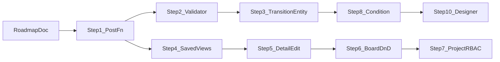

# HFWAS DevOps PM 分步演进路线图

> 版本：1.0  
> 更新日期：2026-07-09  
> 依据：[pm-jira-comparison.md](./pm-jira-comparison.md)、当前 `pm-core` / 前端 PM 模块实现  
> 每步详细设计见 [`docs/evolution/`](./evolution/)

---

## 1. 目标与原则

### 1.1 产品目标

| 阶段 | 对标 | 含义 |
|------|------|------|
| 近中期 | Jira **Team-managed** MVP | 可演示的 Issue Tracker + 可配工作流 + 基础看板 |
| 中长期 | **Company-managed** + Scrum | 项目权限、Sprint、层级、报表与 DevOps 集成 |

### 1.2 演进原则

1. **每步可演示、可回滚**：前后端同交付；半成品不堆积。
2. **先收口再开新项**：已开工能力优先闭环（文档 + API + UI + 验收）。
3. **复用已有内核**：`QueryEngine`、`FieldValidator`、站内信、方案 Import/Export SPI。
4. **设置页统一标准**：见 §4；新页面必须遵守，旧页面在触及步骤中对齐。
5. **文档先行于步骤落地**：每步产出 `docs/evolution/step-NN-<slug>.md`，并回写对比文档状态。

### 1.3 子文档约定

路径：`docs/evolution/step-NN-<slug>.md`

建议章节：动机与范围、数据模型、API、前端 UI、验收标准、风险与非目标。

---

## 2. 现状基线（相对对比文档的修正）

对比文档 §5.1（2026-07-07）将 Post-function 标为 ❌，**已过时**。

| 能力 | 基线（2026-07-09） | 说明 |
|------|-------------------|------|
| 状态矩阵 + 项目覆盖 | ✅ | `pm_status_definition` + `__any__` |
| 流转路径校验 | ✅ | `validateTransition` |
| **Post-function** | ✅ | `transition_rules` + Executor；内置四类；无 SPI |
| Transition 名称 / ID | ❌ | 仍以 `toStatus` 标识边 |
| Transition Validator | ✅ | Step 2：`REQUIRED_FIELDS` |
| Condition | ❌ | `allowedTransitions` 不评估角色/字段 |
| 可视化设计器 | ❌ | 矩阵表格 |
| 保存视图 UI | ❌ | 后端 API 已有 |
| 项目 RBAC | ❌ | 表预留 |
| 方案 Import/Export UI | ✅ | Step 1 已挂载到事项配置页 |

---

## 3. 分步路线图



| Step | 主题 | ROI 理由 | 文档 |
|------|------|----------|------|
| **1** | 工作流 Post-function 收口 + 设置页 UI 标准 | 半成品收口，立刻可配可跑 | [step-01](./evolution/step-01-workflow-post-functions.md) |
| **2** | Phase B：流转 Validator（必填字段） | 关单前填 Resolution 类刚需 | [step-02](./evolution/step-02-transition-validators.md) |
| **3** | Phase A：Transition 实体化（id/name） | 为条件/设计器铺路 | 待写 |
| **4** | P0：保存视图 UI | 后端已有，投入产出极高 | 待写 |
| **5** | P0：详情页完整编辑（标题/描述） | 核心交互差距 | 待写 |
| **6** | P0：看板拖拽 + 统一走 transition | Kanban 标志能力 | 待写 |
| **7** | P0：项目成员与权限 | 安全协作底座（工作量大） | 待写 |
| **8** | Phase D：Condition（QuerySpec 可见性） | 高级工作流 | 待写 |
| **9** | P1：评论/状态通知、链接删除、层级 | 协作闭环 | 待写 |
| **10** | Phase E：可视化设计器（矩阵保留简易模式） | 体验增强 | 待写 |
| **11** | P1–P2：Sprint、附件、报表 | 企业扩展 | 待写 |
| **12** | Phase F + P3：SPI、JQL、迁移工具 | 长期对标 | 待写 |

### 3.1 Step 1 — Post-function 收口（当前）

- **目标**：内置后置动作可配置、可执行、可导入导出；设置页视觉统一。
- **后端**：`transition_rules`、四类动作、`post-function-meta`、保存时校验。
- **前端**：工作流规则 Drawer、方案 I/O 挂载、设置页壳层对齐。
- **非目标**：Validator / Condition / 流转名称 / 可视化设计器 / 项目权限。

### 3.2 Step 2 — Validator

- 在 `TransitionRule` 上增加 `validators[]`（首期：`REQUIRED_FIELDS`）。
- `transition` / 状态变更 `save` 提交前校验；前端流转确认弹窗收集必填字段。
- **状态：已完成**（见 [step-02](./evolution/step-02-transition-validators.md)）。

### 3.3 Step 3 — Transition 实体化

- 边从「目标 statusCode」升级为带 `id`、`name`、`from`、`to` 的 Transition。
- API 兼容：短期仍接受 `toStatus`；UI 展示流转名称。

### 3.4 Step 4–7 — P0 体验与权限

| Step | 要点 |
|------|------|
| 4 | 列表页挂载 `pmViewApi`：保存 / 切换 / 删除个人视图 |
| 5 | 详情标题、描述可编辑；Markdown 编辑器复用 |
| 6 | 看板拖拽改状态；详情侧栏状态变更优先走 `transition` |
| 7 | 落地 `pm_project_member` + Browse/Edit/Transition 等权限点 |

### 3.5 Step 8–12 — 高级工作流与企业能力

Condition（复用 QuerySpec）→ 协作增强 → Vue Flow 设计器 → Sprint/附件/报表 → SPI/JQL/迁移。

---

## 4. 前端设置页统一标准

所有 `/pm/projects/:id/settings/*` 页面遵守以下约定（Step 1 起强制落地）。

### 4.1 页面壳层

```vue
<n-space vertical size="large">
  <n-page-header title="…" subtitle="…">
    <template #extra>…主操作…</template>
  </n-page-header>
  <n-card size="small">…主内容…</n-card>
</n-space>
```

- 需要返回上级时使用 `n-page-header` 的 `@back`（参考事项类型布局页）。
- **禁止**根级用无 header 的裸 `n-card` 充当整页标题（历史 `ModuleManageView` 已在 Step 1 对齐）。

### 4.2 组件选型

| 场景 | 组件 |
|------|------|
| 列表 | 优先 `n-data-table` |
| 复杂编辑 | Drawer，宽度 480–600px |
| 短表单 | `n-modal` + `preset="card"` |
| 类型/状态色 | `TYPE_META` / `statusTagColor()` |
| 项目 ID | 统一 `routeId()`，禁止裸 `Number(route.params…)` |

### 4.3 视觉与文案

- 使用 Naive 主题色与 CSS 变量；少硬编码 `#18a058` / `#fafafa` / `#999`。
- **设置页禁止 emoji 图标**；用文字标签或 Naive 图标组件。
- 副标题可简短类比 Jira，但主文案面向本产品用户。
- 保存反馈：成功 / 失败均有 `useMessage`；批量保存页明确「需点保存才生效」。

### 4.4 参考实现

- [`FieldCatalogView.vue`](../frontend/src/modules/pm/views/settings/FieldCatalogView.vue)
- [`IssueTypeLayoutView.vue`](../frontend/src/modules/pm/views/settings/IssueTypeLayoutView.vue)
- [`IssueTypeListView.vue`](../frontend/src/modules/pm/views/settings/IssueTypeListView.vue)

---

## 5. 与对比文档的关系

- 能力差距与优先级仍以 [pm-jira-comparison.md](./pm-jira-comparison.md) 为对照表。
- **实施顺序以本路线图为准**（ROI 驱动，不完全等于对比文档 P0 列表顺序）。
- 每步完成后：更新对比文档对应行状态 + 修订记录；更新 [pm-api.md](./pm-api.md) 若有 API 变更。

---

## 6. 修订记录

| 版本 | 日期 | 说明 |
|------|------|------|
| 1.0 | 2026-07-09 | 初版：12 步路线图 + 设置页 UI 标准；启动 Step 1 |
